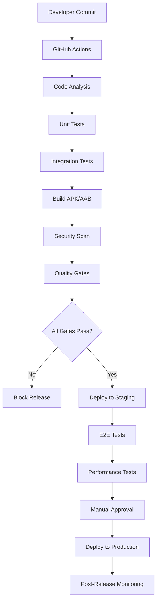

# Budget Tracker Smart v1.0.0 - Deployment e Release Management

**Documento**: Deployment e Release Management v1.0.0  
**Progetto**: Budget Tracker Smart  
**Versione Documento**: 1.0  
**Data**: 13 Settembre 2025  
**Autore**: DevOps Team  
**Stato**: APPROVATO per implementazione

---

## 1. DEPLOYMENT STRATEGY OVERVIEW

### 1.1 Release Objectives
- **Zero-Downtime Deployment**: Distribuzione senza interruzioni per gli utenti
- **Automated Pipeline**: CI/CD completamente automatizzata
- **Quality Gates**: Release solo se tutti i criteri di qualità sono soddisfatti
- **Rollback Capability**: Possibilità di rollback rapido in caso di problemi
- **Multi-Platform Release**: Deploy simultaneo su Android e iOS
- **Monitoring & Alerting**: Monitoraggio proattivo post-release

### 1.2 Release Environments

| **Environment** | **Purpose** | **Deployment** | **Data** | **Access** |
|----------------|-------------|----------------|-----------|-----------|
| **Development** | Feature development | Auto on commit | Mock/Test data | Developers |
| **Staging** | Pre-production testing | Auto on PR merge | Sanitized prod data | QA Team |
| **Beta** | User acceptance testing | Manual trigger | Limited real data | Beta testers |
| **Production** | Live application | Manual approval | Live user data | End users |

### 1.3 Deployment Architecture



---

## 2. CONTINUOUS INTEGRATION PIPELINE

### 2.1 GitHub Actions Workflow

#### 2.1.1 Main CI/CD Pipeline
```yaml
# .github/workflows/main.yml
name: Budget Tracker CI/CD

on:
  push:
    branches: [ main, develop ]
  pull_request:
    branches: [ main ]
  release:
    types: [ created ]

env:
  FLUTTER_VERSION: '3.24.3'
  ANDROID_API_LEVEL: 34
  ANDROID_BUILD_TOOLS: '34.0.0'

jobs:
  # ==========================================
  # CODE QUALITY CHECKS
  # ==========================================
  analyze:
    name: Code Analysis
    runs-on: ubuntu-latest
    
    steps:
    - name: Checkout code
      uses: actions/checkout@v4
      
    - name: Setup Flutter
      uses: subosito/flutter-action@v2
      with:
        flutter-version: ${{ env.FLUTTER_VERSION }}
        channel: 'stable'
        cache: true
        
    - name: Get dependencies
      run: flutter pub get
      
    - name: Verify code formatting
      run: dart format --set-exit-if-changed .
      
    - name: Analyze Dart code
      run: flutter analyze --no-fatal-infos
      
    - name: Check pub dependencies
      run: flutter pub deps --no-dev
      
    - name: Run custom linting
      run: |
        dart run custom_lint_runner
        
    - name: Security audit
      run: |
        dart run security_audit_runner

  # ==========================================
  # UNIT AND WIDGET TESTS
  # ==========================================
  test:
    name: Unit & Widget Tests
    runs-on: ubuntu-latest
    needs: analyze
    
    steps:
    - name: Checkout code
      uses: actions/checkout@v4
      
    - name: Setup Flutter
      uses: subosito/flutter-action@v2
      with:
        flutter-version: ${{ env.FLUTTER_VERSION }}
        channel: 'stable'
        cache: true
        
    - name: Get dependencies
      run: flutter pub get
      
    - name: Run tests with coverage
      run: flutter test --coverage --reporter=json > test_results.json
      
    - name: Upload coverage to Codecov
      uses: codecov/codecov-action@v3
      with:
        files: coverage/lcov.info
        flags: unittests
        name: budget-tracker-coverage
        
    - name: Generate coverage report
      run: |
        dart run coverage_reporter
        
    - name: Check coverage threshold
      run: |
        coverage_percentage=$(dart run coverage_checker)
        if (( $(echo "$coverage_percentage < 80" | bc -l) )); then
          echo "Coverage $coverage_percentage% is below 80% threshold"
          exit 1
        fi
        
    - name: Upload test artifacts
      uses: actions/upload-artifact@v4
      with:
        name: test-results
        path: |
          test_results.json
          coverage/
          test_report.html

  # ==========================================
  # ANDROID BUILD
  # ==========================================
  build_android:
    name: Build Android
    runs-on: ubuntu-latest
    needs: [analyze, test]
    
    steps:
    - name: Checkout code
      uses: actions/checkout@v4
      
    - name: Setup Java
      uses: actions/setup-java@v4
      with:
        distribution: 'temurin'
        java-version: '17'
        
    - name: Setup Android SDK
      uses: android-actions/setup-android@v3
      with:
        api-level: ${{ env.ANDROID_API_LEVEL }}
        build-tools: ${{ env.ANDROID_BUILD_TOOLS }}
        
    - name: Setup Flutter
      uses: subosito/flutter-action@v2
      with:
        flutter-version: ${{ env.FLUTTER_VERSION }}
        channel: 'stable'
        cache: true
        
    - name: Get dependencies
      run: flutter pub get
      
    - name: Build APK (Debug)
      if: github.event_name == 'pull_request'
      run: flutter build apk --debug --dart-define=ENVIRONMENT=staging
      
    - name: Build APK (Release)
      if: github.ref == 'refs/heads/main' || github.event_name == 'release'
      run: flutter build apk --release --dart-define=ENVIRONMENT=production
      env:
        ANDROID_KEYSTORE_PASSWORD: ${{ secrets.ANDROID_KEYSTORE_PASSWORD }}
        ANDROID_KEY_PASSWORD: ${{ secrets.ANDROID_KEY_PASSWORD }}
        ANDROID_KEY_ALIAS: ${{ secrets.ANDROID_KEY_ALIAS }}
        
    - name: Build AAB (Production only)
      if: github.event_name == 'release'
      run: flutter build appbundle --release --dart-define=ENVIRONMENT=production
      env:
        ANDROID_KEYSTORE_PASSWORD: ${{ secrets.ANDROID_KEYSTORE_PASSWORD }}
        ANDROID_KEY_PASSWORD: ${{ secrets.ANDROID_KEY_PASSWORD }}
        ANDROID_KEY_ALIAS: ${{ secrets.ANDROID_KEY_ALIAS }}
        
    - name: Sign APK
      if: github.ref == 'refs/heads/main' || github.event_name == 'release'
      uses: r0adkll/sign-android-release@v1
      with:
        releaseDirectory: build/app/outputs/apk/release
        signingKeyBase64: ${{ secrets.ANDROID_KEYSTORE_BASE64 }}
        alias: ${{ secrets.ANDROID_KEY_ALIAS }}
        keyStorePassword: ${{ secrets.ANDROID_KEYSTORE_PASSWORD }}
        keyPassword: ${{ secrets.ANDROID_KEY_PASSWORD }}
        
    - name: Verify APK signature
      if: github.ref == 'refs/heads/main' || github.event_name == 'release'
      run: |
        jarsigner -verify -verbose -certs build/app/outputs/apk/release/app-release.apk
        
    - name: Run security scan on APK
      uses: github/super-linter@v5
      env:
        DEFAULT_BRANCH: main
        GITHUB_TOKEN: ${{ secrets.GITHUB_TOKEN }}
        VALIDATE_ANDROID: true
        
    - name: Upload APK artifact
      uses: actions/upload-artifact@v4
      with:
        name: android-apk
        path: build/app/outputs/apk/release/app-release.apk
        
    - name: Upload AAB artifact (Production)
      if: github.event_name == 'release'
      uses: actions/upload-artifact@v4
      with:
        name: android-aab
        path: build/app/outputs/bundle/release/app-release.aab

  # ==========================================
  # iOS BUILD
  # ==========================================
  build_ios:
    name: Build iOS
    runs-on: macos-latest
    needs: [analyze, test]
    if: github.ref == 'refs/heads/main' || github.event_name == 'release'
    
    steps:
    - name: Checkout code
      uses: actions/checkout@v4
      
    - name: Setup Flutter
      uses: subosito/flutter-action@v2
      with:
        flutter-version: ${{ env.FLUTTER_VERSION }}
        channel: 'stable'
        cache: true
        
    - name: Setup Xcode
      uses: maxim-lobanov/setup-xcode@v1
      with:
        xcode-version: '15.0'
        
    - name: Setup iOS certificates
      uses: apple-actions/import-codesign-certs@v2
      with:
        p12-file-base64: ${{ secrets.IOS_CERTIFICATE_P12 }}
        p12-password: ${{ secrets.IOS_CERTIFICATE_PASSWORD }}
        
    - name: Setup iOS provisioning profiles
      uses: apple-actions/download-provisioning-profiles@v2
      with:
        bundle-id: com.budgettracker.app
        profile-type: 'IOS_APP_STORE'
        issuer-id: ${{ secrets.APPSTORE_ISSUER_ID }}
        api-key-id: ${{ secrets.APPSTORE_KEY_ID }}
        api-private-key: ${{ secrets.APPSTORE_PRIVATE_KEY }}
        
    - name: Get dependencies
      run: flutter pub get
      
    - name: Build iOS (Release)
      run: flutter build ipa --release --dart-define=ENVIRONMENT=production
      
    - name: Upload iOS artifact
      uses: actions/upload-artifact@v4
      with:
        name: ios-ipa
        path: build/ios/ipa/Budget Tracker Smart.ipa

  # ==========================================
  # INTEGRATION TESTS
  # ==========================================
  integration_tests:
    name: Integration Tests
    runs-on: ubuntu-latest
    needs: [build_android]
    
    steps:
    - name: Checkout code
      uses: actions/checkout@v4
      
    - name: Setup Flutter
      uses: subosito/flutter-action@v2
      with:
        flutter-version: ${{ env.FLUTTER_VERSION }}
        channel: 'stable'
        cache: true
        
    - name: Enable KVM group perms
      run: |
        echo 'KERNEL=="kvm", GROUP="kvm", MODE="0666", OPTIONS+="static_node=kvm"' | sudo tee /etc/udev/rules.d/99-kvm4all.rules
        sudo udevadm control --reload-rules
        sudo udevadm trigger --name-match=kvm
        
    - name: Setup Android emulator
      uses: reactivecircus/android-emulator-runner@v2
      with:
        api-level: 31
        arch: x86_64
        profile: Nexus 6
        script: |
          flutter pub get
          flutter test integration_test/ --device-id emulator-5554
          
    - name: Upload integration test results
      uses: actions/upload-artifact@v4
      with:
        name: integration-test-results
        path: integration_test/results/

  # ==========================================
  # QUALITY GATES
  # ==========================================
  quality_gates:
    name: Quality Gates
    runs-on: ubuntu-latest
    needs: [test, integration_tests]
    
    steps:
    - name: Checkout code
      uses: actions/checkout@v4
      
    - name: Download test artifacts
      uses: actions/download-artifact@v4
      with:
        name: test-results
        
    - name: Download integration test results
      uses: actions/download-artifact@v4
      with:
        name: integration-test-results
        
    - name: Setup Flutter
      uses: subosito/flutter-action@v2
      with:
        flutter-version: ${{ env.FLUTTER_VERSION }}
        channel: 'stable'
        cache: true
        
    - name: Run quality gate checks
      run: |
        dart run quality_gates_runner.dart
        
    - name: Generate quality report
      run: |
        dart run quality_reporter.dart
        
    - name: Upload quality report
      uses: actions/upload-artifact@v4
      with:
        name: quality-report
        path: quality_report.html
        
    - name: Comment PR with quality results
      if: github.event_name == 'pull_request'
      uses: actions/github-script@v7
      with:
        script: |
          const fs = require('fs');
          const report = fs.readFileSync('quality_summary.md', 'utf8');
          
          github.rest.issues.createComment({
            issue_number: context.issue.number,
            owner: context.repo.owner,
            repo: context.repo.repo,
            body: report
          });

  # ==========================================
  # DEPLOYMENT TO STAGING
  # ==========================================
  deploy_staging:
    name: Deploy to Staging
    runs-on: ubuntu-latest
    needs: [quality_gates, build_android]
    if: github.ref == 'refs/heads/develop'
    
    environment:
      name: staging
      url: https://staging.budgettracker.app
      
    steps:
    - name: Checkout code
      uses: actions/checkout@v4
      
    - name: Download Android APK
      uses: actions/download-artifact@v4
      with:
        name: android-apk
        path: ./artifacts
        
    - name: Deploy to Firebase App Distribution
      uses: wzieba/Firebase-Distribution-Github-Action@v1
      with:
        appId: ${{ secrets.FIREBASE_STAGING_APP_ID }}
        serviceCredentialsFileContent: ${{ secrets.FIREBASE_SERVICE_ACCOUNT }}
        groups: staging-testers
        file: ./artifacts/app-release.apk
        releaseNotes: |
          Staging release for ${{ github.sha }}
          
          Changes in this build:
          ${{ github.event.head_commit.message }}
          
    - name: Update staging database
      run: |
        # Run any necessary database migrations for staging
        dart run staging_db_migrator.dart
        
    - name: Run smoke tests on staging
      run: |
        dart run staging_smoke_tests.dart
        
    - name: Notify team of staging deployment
      uses: 8398a7/action-slack@v3
      with:
        status: success
        text: 'Staging deployment successful! 🎉\nCommit: ${{ github.sha }}\nTester download: Firebase App Distribution'
        webhook_url: ${{ secrets.SLACK_WEBHOOK_URL }}

  # ==========================================
  # PRODUCTION DEPLOYMENT
  # ==========================================
  deploy_production:
    name: Deploy to Production
    runs-on: ubuntu-latest
    needs: [quality_gates, build_android, build_ios]
    if: github.event_name == 'release'
    
    environment:
      name: production
      url: https://play.google.com/store/apps/details?id=com.budgettracker.app
      
    steps:
    - name: Checkout code
      uses: actions/checkout@v4
      
    - name: Download Android AAB
      uses: actions/download-artifact@v4
      with:
        name: android-aab
        path: ./artifacts
        
    - name: Download iOS IPA
      uses: actions/download-artifact@v4
      with:
        name: ios-ipa
        path: ./artifacts
        
    # Android Play Store deployment
    - name: Deploy to Google Play Store
      uses: r0adkll/upload-google-play@v1.1.3
      with:
        serviceAccountJsonPlainText: ${{ secrets.GOOGLE_PLAY_SERVICE_ACCOUNT }}
        packageName: com.budgettracker.app
        releaseFiles: ./artifacts/app-release.aab
        track: production
        status: completed
        whatsNewDirectory: fastlane/metadata/android
        
    # iOS App Store deployment  
    - name: Deploy to Apple App Store
      uses: apple-actions/upload-testflight-build@v1
      with:
        app-path: ./artifacts/Budget Tracker Smart.ipa
        issuer-id: ${{ secrets.APPSTORE_ISSUER_ID }}
        api-key-id: ${{ secrets.APPSTORE_KEY_ID }}
        api-private-key: ${{ secrets.APPSTORE_PRIVATE_KEY }}
        
    - name: Create GitHub release
      uses: actions/create-release@v1
      env:
        GITHUB_TOKEN: ${{ secrets.GITHUB_TOKEN }}
      with:
        tag_name: ${{ github.ref }}
        release_name: Budget Tracker Smart ${{ github.ref }}
        body: |
          ## What's New in Budget Tracker Smart v1.0.0
          
          🎉 **Initial Release**
          
          ### ✨ Features
          - **Smart Health Score**: AI-powered financial health monitoring
          - **OCR Receipt Scanning**: Automatic transaction extraction from receipts
          - **ML Categorization**: Intelligent expense categorization
          - **Beautiful Dashboard**: Intuitive financial overview
          - **Comprehensive Reports**: Detailed spending analytics
          - **Offline-First**: Works completely offline for privacy
          
          ### 📱 Supported Platforms
          - Android 7.0+ (API level 24+)
          - iOS 12.0+
          
          ### 🔒 Privacy & Security
          - All data stored locally on device
          - End-to-end encryption
          - No data collection or tracking
          
          ### 📥 Download
          - [Google Play Store](https://play.google.com/store/apps/details?id=com.budgettracker.app)
          - [Apple App Store](https://apps.apple.com/app/budget-tracker-smart/id1234567890)
          
          **Full Changelog**: https://github.com/budget-tracker/releases/tag/v1.0.0
        draft: false
        prerelease: false
        
    - name: Post-deployment health check
      run: |
        # Wait for app store processing
        sleep 300
        
        # Check if apps are available in stores
        dart run store_availability_checker.dart
        
    - name: Start post-release monitoring
      run: |
        # Initialize monitoring alerts
        dart run post_release_monitor.dart
        
    - name: Notify success
      uses: 8398a7/action-slack@v3
      with:
        status: success
        text: |
          🚀 **PRODUCTION DEPLOYMENT SUCCESSFUL!** 🚀
          
          Budget Tracker Smart v1.0.0 is now live!
          
          📊 **Release Stats**:
          • Android: Google Play Store
          • iOS: Apple App Store  
          • Release: ${{ github.ref }}
          • Commit: ${{ github.sha }}
          
          🎯 **Next Steps**:
          • Monitor crash rates and performance
          • Track user adoption metrics
          • Prepare v1.1.0 roadmap
        webhook_url: ${{ secrets.SLACK_WEBHOOK_URL }}

    - name: Notify failure
      if: failure()
      uses: 8398a7/action-slack@v3
      with:
        status: failure
        text: |
          🚨 **PRODUCTION DEPLOYMENT FAILED** 🚨
          
          Budget Tracker Smart v1.0.0 deployment encountered errors.
          
          Please check the GitHub Actions logs immediately.
          
          🔧 **Action Required**: Manual intervention needed
        webhook_url: ${{ secrets.SLACK_WEBHOOK_URL }}
```

### 2.2 Quality Gates Implementation

#### 2.2.1 Quality Gates Runner
```dart
// tools/quality_gates_runner.dart
import 'dart:io';
import 'dart:convert';

void main() async {
  print('🔍 Running Quality Gates for Budget Tracker Smart v1.0.0...\n');
  
  final gateResults = <QualityGate>[];
  
  // Gate 1: Code Coverage
  print('📊 Checking Code Coverage...');
  gateResults.add(await checkCodeCoverage());
  
  // Gate 2: Test Success Rate
  print('🧪 Checking Test Success Rate...');
  gateResults.add(await checkTestSuccessRate());
  
  // Gate 3: Performance Benchmarks
  print('⚡ Checking Performance Benchmarks...');
  gateResults.add(await checkPerformanceBenchmarks());
  
  // Gate 4: Security Scan
  print('🔐 Running Security Scan...');
  gateResults.add(await checkSecurityScan());
  
  // Gate 5: Documentation
  print('📚 Checking Documentation...');
  gateResults.add(await checkDocumentation());
  
  // Generate report
  final overallResult = generateQualityReport(gateResults);
  
  // Exit with appropriate code
  if (overallResult) {
    print('\n✅ All Quality Gates PASSED! Release is approved. 🎉');
    exit(0);
  } else {
    print('\n❌ Quality Gates FAILED! Release is blocked. 🚫');
    exit(1);
  }
}

Future<QualityGate> checkCodeCoverage() async {
  try {
    // Read coverage data
    final lcovFile = File('coverage/lcov.info');
    if (!await lcovFile.exists()) {
      return QualityGate(
        name: 'Code Coverage',
        passed: false,
        message: 'Coverage file not found',
        threshold: 80.0,
        actualValue: 0.0,
      );
    }
    
    // Parse coverage percentage (simplified)
    final coverage = await parseCoveragePercentage();
    
    return QualityGate(
      name: 'Code Coverage',
      passed: coverage >= 80.0,
      message: coverage >= 80.0 
          ? 'Coverage ${coverage.toStringAsFixed(1)}% meets minimum requirement'
          : 'Coverage ${coverage.toStringAsFixed(1)}% below 80% threshold',
      threshold: 80.0,
      actualValue: coverage,
    );
  } catch (e) {
    return QualityGate(
      name: 'Code Coverage',
      passed: false,
      message: 'Error checking coverage: $e',
      threshold: 80.0,
      actualValue: 0.0,
    );
  }
}

Future<QualityGate> checkTestSuccessRate() async {
  try {
    // Read test results
    final testResultsFile = File('test_results.json');
    if (!await testResultsFile.exists()) {
      return QualityGate(
        name: 'Test Success Rate',
        passed: false,
        message: 'Test results file not found',
        threshold: 100.0,
        actualValue: 0.0,
      );
    }
    
    final testData = jsonDecode(await testResultsFile.readAsString());
    final totalTests = testData['count'] ?? 0;
    final failedTests = testData['failures'] ?? 0;
    final successRate = totalTests > 0 
        ? ((totalTests - failedTests) / totalTests) * 100 
        : 0.0;
    
    return QualityGate(
      name: 'Test Success Rate',
      passed: failedTests == 0,
      message: failedTests == 0
          ? 'All $totalTests tests passing (100%)'
          : '$failedTests out of $totalTests tests failing',
      threshold: 100.0,
      actualValue: successRate,
    );
  } catch (e) {
    return QualityGate(
      name: 'Test Success Rate',
      passed: false,
      message: 'Error checking test results: $e',
      threshold: 100.0,
      actualValue: 0.0,
    );
  }
}

Future<QualityGate> checkPerformanceBenchmarks() async {
  try {
    // Check if performance benchmark results exist
    final perfResultsFile = File('performance_results.json');
    if (!await perfResultsFile.exists()) {
      return QualityGate(
        name: 'Performance Benchmarks',
        passed: false,
        message: 'Performance results file not found',
        threshold: null,
        actualValue: null,
      );
    }
    
    final perfData = jsonDecode(await perfResultsFile.readAsString());
    
    // Check key performance metrics
    final appLaunchTime = perfData['app_launch_time_ms'] ?? 9999;
    final healthScoreCalc = perfData['health_score_calc_ms'] ?? 9999;
    final transactionSave = perfData['transaction_save_ms'] ?? 9999;
    
    final passed = appLaunchTime < 2000 && 
                  healthScoreCalc < 100 && 
                  transactionSave < 200;
    
    return QualityGate(
      name: 'Performance Benchmarks',
      passed: passed,
      message: passed
          ? 'All performance benchmarks met'
          : 'Performance benchmarks failed: Launch ${appLaunchTime}ms, HealthScore ${healthScoreCalc}ms, Save ${transactionSave}ms',
      threshold: null,
      actualValue: null,
    );
  } catch (e) {
    return QualityGate(
      name: 'Performance Benchmarks',
      passed: false,
      message: 'Error checking performance: $e',
      threshold: null,
      actualValue: null,
    );
  }
}

Future<QualityGate> checkSecurityScan() async {
  try {
    // Run security audit
    final result = await Process.run('dart', ['pub', 'audit']);
    
    final hasVulnerabilities = result.stdout.toString().contains('vulnerability') ||
                             result.exitCode != 0;
    
    return QualityGate(
      name: 'Security Scan',
      passed: !hasVulnerabilities,
      message: hasVulnerabilities
          ? 'Security vulnerabilities found in dependencies'
          : 'No security vulnerabilities found',
      threshold: null,
      actualValue: null,
    );
  } catch (e) {
    return QualityGate(
      name: 'Security Scan',
      passed: false,
      message: 'Error running security scan: $e',
      threshold: null,
      actualValue: null,
    );
  }
}

Future<QualityGate> checkDocumentation() async {
  final requiredDocs = [
    'README.md',
    'CHANGELOG.md',
    'docs/user-guide.md',
    'docs/technical-specs.md',
  ];
  
  final missingDocs = <String>[];
  
  for (final doc in requiredDocs) {
    if (!await File(doc).exists()) {
      missingDocs.add(doc);
    }
  }
  
  return QualityGate(
    name: 'Documentation',
    passed: missingDocs.isEmpty,
    message: missingDocs.isEmpty
        ? 'All required documentation present'
        : 'Missing documentation: ${missingDocs.join(', ')}',
    threshold: null,
    actualValue: null,
  );
}

bool generateQualityReport(List<QualityGate> gates) {
  final passedGates = gates.where((gate) => gate.passed).length;
  final totalGates = gates.length;
  
  print('\n' + '=' * 60);
  print('📋 QUALITY GATES SUMMARY');
  print('=' * 60);
  
  for (final gate in gates) {
    final status = gate.passed ? '✅ PASS' : '❌ FAIL';
    print('$status | ${gate.name}');
    print('      ${gate.message}');
    if (gate.threshold != null && gate.actualValue != null) {
      print('      Actual: ${gate.actualValue!.toStringAsFixed(1)}, Threshold: ${gate.threshold!.toStringAsFixed(1)}');
    }
    print('');
  }
  
  print('📊 OVERALL RESULT: $passedGates/$totalGates gates passed');
  
  // Write summary for GitHub PR comment
  _writePRSummary(gates, passedGates, totalGates);
  
  return passedGates == totalGates;
}

void _writePRSummary(List<QualityGate> gates, int passedGates, int totalGates) {
  final summary = StringBuffer();
  summary.writeln('## 🎯 Quality Gates Report\n');
  
  final overallStatus = passedGates == totalGates ? '✅ PASSED' : '❌ FAILED';
  summary.writeln('**Overall Status**: $overallStatus ($passedGates/$totalGates)\n');
  
  summary.writeln('### Gate Results:\n');
  
  for (final gate in gates) {
    final status = gate.passed ? '✅' : '❌';
    summary.writeln('- $status **${gate.name}**: ${gate.message}');
  }
  
  if (passedGates == totalGates) {
    summary.writeln('\n🎉 **All quality gates passed! This PR is ready for release.**');
  } else {
    summary.writeln('\n🚫 **Quality gates failed. Please fix the issues before merging.**');
  }
  
  File('quality_summary.md').writeAsStringSync(summary.toString());
}

Future<double> parseCoveragePercentage() async {
  // Simplified coverage parsing - real implementation would be more robust
  final lcovContent = await File('coverage/lcov.info').readAsString();
  
  int totalLines = 0;
  int coveredLines = 0;
  
  for (final line in lcovContent.split('\n')) {
    if (line.startsWith('LF:')) {
      totalLines += int.tryParse(line.substring(3)) ?? 0;
    } else if (line.startsWith('LH:')) {
      coveredLines += int.tryParse(line.substring(3)) ?? 0;
    }
  }
  
  return totalLines > 0 ? (coveredLines / totalLines) * 100 : 0.0;
}

class QualityGate {
  final String name;
  final bool passed;
  final String message;
  final double? threshold;
  final double? actualValue;
  
  QualityGate({
    required this.name,
    required this.passed,
    required this.message,
    this.threshold,
    this.actualValue,
  });
}
```

---

## 3. ENVIRONMENT CONFIGURATION

### 3.1 Environment-Specific Configurations

#### 3.1.1 Environment Configuration Class
```dart
// lib/config/environment_config.dart
enum Environment {
  development,
  staging, 
  beta,
  production,
}

class EnvironmentConfig {
  static const String _envKey = 'ENVIRONMENT';
  
  static Environment get current {
    const envString = String.fromEnvironment(_envKey, defaultValue: 'development');
    
    switch (envString.toLowerCase()) {
      case 'staging':
        return Environment.staging;
      case 'beta':
        return Environment.beta;
      case 'production':
        return Environment.production;
      default:
        return Environment.development;
    }
  }
  
  static EnvironmentSettings get settings {
    switch (current) {
      case Environment.development:
        return _developmentSettings;
      case Environment.staging:
        return _stagingSettings;
      case Environment.beta:
        return _betaSettings;
      case Environment.production:
        return _productionSettings;
    }
  }
  
  static final _developmentSettings = EnvironmentSettings(
    appName: 'Budget Tracker [DEV]',
    apiBaseUrl: 'https://dev-api.budgettracker.app',
    databaseName: 'budget_tracker_dev.db',
    enableDebugLogging: true,
    enablePerformanceMonitoring: false,
    enableCrashReporting: false,
    mlModelVersion: 'dev',
    healthScoreRefreshInterval: Duration(seconds: 5), // Faster for testing
  );
  
  static final _stagingSettings = EnvironmentSettings(
    appName: 'Budget Tracker [STAGING]',
    apiBaseUrl: 'https://staging-api.budgettracker.app',
    databaseName: 'budget_tracker_staging.db',
    enableDebugLogging: true,
    enablePerformanceMonitoring: true,
    enableCrashReporting: true,
    mlModelVersion: 'staging',
    healthScoreRefreshInterval: Duration(minutes: 1),
  );
  
  static final _betaSettings = EnvironmentSettings(
    appName: 'Budget Tracker [BETA]',
    apiBaseUrl: 'https://beta-api.budgettracker.app',
    databaseName: 'budget_tracker_beta.db',
    enableDebugLogging: false,
    enablePerformanceMonitoring: true,
    enableCrashReporting: true,
    mlModelVersion: 'beta',
    healthScoreRefreshInterval: Duration(minutes: 5),
  );
  
  static final _productionSettings = EnvironmentSettings(
    appName: 'Budget Tracker Smart',
    apiBaseUrl: 'https://api.budgettracker.app',
    databaseName: 'budget_tracker.db',
    enableDebugLogging: false,
    enablePerformanceMonitoring: true,
    enableCrashReporting: true,
    mlModelVersion: 'v1.0',
    healthScoreRefreshInterval: Duration(minutes: 5),
  );
}

class EnvironmentSettings {
  final String appName;
  final String apiBaseUrl;
  final String databaseName;
  final bool enableDebugLogging;
  final bool enablePerformanceMonitoring;
  final bool enableCrashReporting;
  final String mlModelVersion;
  final Duration healthScoreRefreshInterval;
  
  const EnvironmentSettings({
    required this.appName,
    required this.apiBaseUrl,
    required this.databaseName,
    required this.enableDebugLogging,
    required this.enablePerformanceMonitoring,
    required this.enableCrashReporting,
    required this.mlModelVersion,
    required this.healthScoreRefreshInterval,
  });
}

// Usage in main.dart
void main() async {
  WidgetsFlutterBinding.ensureInitialized();
  
  // Initialize environment-specific configurations
  await _initializeEnvironment();
  
  runApp(MyApp());
}

Future<void> _initializeEnvironment() async {
  final settings = EnvironmentConfig.settings;
  
  // Setup logging based on environment
  if (settings.enableDebugLogging) {
    Logger.root.level = Level.ALL;
    Logger.root.onRecord.listen(print);
  }
  
  // Setup crash reporting
  if (settings.enableCrashReporting) {
    await FirebaseCrashlytics.instance.setCrashlyticsCollectionEnabled(true);
  }
  
  // Setup performance monitoring
  if (settings.enablePerformanceMonitoring) {
    await FirebasePerformance.instance.setPerformanceCollectionEnabled(true);
  }
  
  print('🚀 Starting ${settings.appName} in ${EnvironmentConfig.current.name} mode');
}
```

### 3.2 Build Configuration Files

#### 3.2.1 Android Build Configuration
```gradle
// android/app/build.gradle
android {
    compileSdkVersion 34
    buildToolsVersion "34.0.0"
    
    compileOptions {
        sourceCompatibility JavaVersion.VERSION_1_8
        targetCompatibility JavaVersion.VERSION_1_8
    }
    
    defaultConfig {
        applicationId "com.budgettracker.app"
        minSdkVersion 24
        targetSdkVersion 34
        versionCode flutterVersionCode.toInteger()
        versionName flutterVersionName
        
        testInstrumentationRunner "androidx.test.runner.AndroidJUnitRunner"
        multiDexEnabled true
        
        // Default environment
        buildConfigField "String", "ENVIRONMENT", '"production"'
        resValue "string", "app_name", "Budget Tracker Smart"
    }
    
    signingConfigs {
        release {
            keyAlias System.getenv("ANDROID_KEY_ALIAS")
            keyPassword System.getenv("ANDROID_KEY_PASSWORD")
            storeFile file("../keystore/upload-keystore.jks")
            storePassword System.getenv("ANDROID_KEYSTORE_PASSWORD")
        }
    }
    
    buildTypes {
        debug {
            applicationIdSuffix ".debug"
            versionNameSuffix "-debug"
            buildConfigField "String", "ENVIRONMENT", '"development"'
            resValue "string", "app_name", "Budget Tracker [DEV]"
            signingConfig signingConfigs.debug
            debuggable true
            minifyEnabled false
        }
        
        staging {
            applicationIdSuffix ".staging"
            versionNameSuffix "-staging"
            buildConfigField "String", "ENVIRONMENT", '"staging"'
            resValue "string", "app_name", "Budget Tracker [STAGING]"
            signingConfig signingConfigs.release
            debuggable false
            minifyEnabled true
            shrinkResources true
            proguardFiles getDefaultProguardFile('proguard-android-optimize.txt'), 'proguard-rules.pro'
        }
        
        release {
            buildConfigField "String", "ENVIRONMENT", '"production"'
            resValue "string", "app_name", "Budget Tracker Smart"
            signingConfig signingConfigs.release
            debuggable false
            minifyEnabled true
            shrinkResources true
            proguardFiles getDefaultProguardFile('proguard-android-optimize.txt'), 'proguard-rules.pro'
            
            // Enable R8 full mode
            proguardFiles getDefaultProguardFile('proguard-android-optimize.txt'), 'proguard-rules.pro'
        }
    }
    
    flavorDimensions "version"
    productFlavors {
        free {
            dimension "version"
            applicationIdSuffix ".free"
        }
        
        pro {
            dimension "version" 
            applicationIdSuffix ".pro"
        }
    }
}

dependencies {
    implementation 'androidx.multidex:multidex:2.0.1'
    implementation 'com.google.firebase:firebase-crashlytics:18.5.0'
    implementation 'com.google.firebase:firebase-analytics:21.3.0'
    implementation 'com.google.firebase:firebase-perf:20.4.1'
    
    testImplementation 'junit:junit:4.13.2'
    androidTestImplementation 'androidx.test.ext:junit:1.1.5'
    androidTestImplementation 'androidx.test.espresso:espresso-core:3.5.1'
}

apply plugin: 'com.google.gms.google-services'
apply plugin: 'com.google.firebase.crashlytics'
apply plugin: 'com.google.firebase.firebase-perf'
```

#### 3.2.2 iOS Build Configuration
```ruby
# ios/fastlane/Fastfile
default_platform(:ios)

platform :ios do
  desc "Build and upload to TestFlight"
  lane :beta do
    setup_ci if ENV['CI']
    
    match(type: "appstore")
    
    build_app(
      workspace: "Runner.xcworkspace",
      scheme: "Runner",
      configuration: "Release",
      export_method: "app-store",
      export_options: {
        provisioningProfiles: {
          "com.budgettracker.app" => "Budget Tracker Smart AppStore"
        }
      }
    )
    
    upload_to_testflight(
      api_key_path: "fastlane/AuthKey.p8",
      skip_waiting_for_build_processing: true,
      groups: ["Internal Testers"],
      changelog: "Latest build from CI/CD pipeline"
    )
  end
  
  desc "Deploy to App Store"
  lane :release do
    setup_ci if ENV['CI']
    
    match(type: "appstore")
    
    build_app(
      workspace: "Runner.xcworkspace",
      scheme: "Runner",
      configuration: "Release",
      export_method: "app-store"
    )
    
    upload_to_app_store(
      api_key_path: "fastlane/AuthKey.p8",
      submit_for_review: false,
      automatic_release: false,
      force: true,
      metadata_path: "fastlane/metadata"
    )
  end
end
```

---

## 4. SECURITY AND SECRETS MANAGEMENT

### 4.1 GitHub Secrets Configuration

#### 4.1.1 Required Secrets
```yaml
# Repository Secrets Configuration
SECRETS_REQUIRED:
  # Android Signing
  ANDROID_KEYSTORE_BASE64: "Base64 encoded keystore file"
  ANDROID_KEYSTORE_PASSWORD: "Keystore password"
  ANDROID_KEY_ALIAS: "Key alias in keystore"
  ANDROID_KEY_PASSWORD: "Key password"
  
  # iOS Signing
  IOS_CERTIFICATE_P12: "Base64 encoded P12 certificate"
  IOS_CERTIFICATE_PASSWORD: "P12 certificate password"
  
  # App Store Connect
  APPSTORE_ISSUER_ID: "App Store Connect API issuer ID"
  APPSTORE_KEY_ID: "App Store Connect API key ID"
  APPSTORE_PRIVATE_KEY: "App Store Connect API private key"
  
  # Google Play Console
  GOOGLE_PLAY_SERVICE_ACCOUNT: "Service account JSON for Play Console"
  
  # Firebase
  FIREBASE_SERVICE_ACCOUNT: "Firebase service account JSON"
  FIREBASE_STAGING_APP_ID: "Firebase App ID for staging"
  FIREBASE_PROD_APP_ID: "Firebase App ID for production"
  
  # Notifications
  SLACK_WEBHOOK_URL: "Slack webhook for deployment notifications"
  
  # API Keys (if future versions need them)
  API_ENCRYPTION_KEY: "Key for API communications"
  
  # Database Encryption
  DB_ENCRYPTION_KEY: "Database encryption key"
```

#### 4.1.2 Secrets Validation Script
```bash
#!/bin/bash
# tools/validate_secrets.sh

echo "🔐 Validating GitHub Secrets..."

REQUIRED_SECRETS=(
    "ANDROID_KEYSTORE_BASE64"
    "ANDROID_KEYSTORE_PASSWORD" 
    "ANDROID_KEY_ALIAS"
    "ANDROID_KEY_PASSWORD"
    "IOS_CERTIFICATE_P12"
    "IOS_CERTIFICATE_PASSWORD"
    "APPSTORE_ISSUER_ID"
    "APPSTORE_KEY_ID"
    "APPSTORE_PRIVATE_KEY"
    "GOOGLE_PLAY_SERVICE_ACCOUNT"
    "FIREBASE_SERVICE_ACCOUNT"
    "SLACK_WEBHOOK_URL"
)

MISSING_SECRETS=()

for secret in "${REQUIRED_SECRETS[@]}"; do
    if [ -z "${!secret}" ]; then
        MISSING_SECRETS+=("$secret")
    fi
done

if [ ${#MISSING_SECRETS[@]} -eq 0 ]; then
    echo "✅ All required secrets are configured!"
    exit 0
else
    echo "❌ Missing secrets:"
    for secret in "${MISSING_SECRETS[@]}"; do
        echo "  - $secret"
    done
    echo ""
    echo "Please configure these secrets in GitHub repository settings."
    exit 1
fi
```

### 4.2 Key Generation and Management

#### 4.2.1 Android Keystore Generation
```bash
#!/bin/bash
# tools/generate_android_keystore.sh

echo "🔑 Generating Android Keystore..."

KEYSTORE_PATH="android/keystore/upload-keystore.jks"
KEYSTORE_PASSWORD=$(openssl rand -base64 32)
KEY_PASSWORD=$(openssl rand -base64 32)
KEY_ALIAS="budget-tracker-key"

# Create keystore directory
mkdir -p android/keystore

# Generate keystore
keytool -genkeypair \
    -alias "$KEY_ALIAS" \
    -keypass "$KEY_PASSWORD" \
    -keystore "$KEYSTORE_PATH" \
    -storepass "$KEYSTORE_PASSWORD" \
    -keyalg RSA \
    -keysize 2048 \
    -validity 25000 \
    -dname "CN=Budget Tracker Smart, OU=Development, O=Budget Tracker, L=Milano, ST=Lombardia, C=IT"

echo "✅ Keystore generated successfully!"
echo ""
echo "🔐 Store these values as GitHub Secrets:"
echo "ANDROID_KEYSTORE_PASSWORD: $KEYSTORE_PASSWORD"
echo "ANDROID_KEY_PASSWORD: $KEY_PASSWORD"
echo "ANDROID_KEY_ALIAS: $KEY_ALIAS"
echo ""
echo "📁 Upload keystore to GitHub Secrets as base64:"
echo "ANDROID_KEYSTORE_BASE64: $(base64 -w 0 $KEYSTORE_PATH)"
```

#### 4.2.2 iOS Certificate Management
```bash
#!/bin/bash
# tools/setup_ios_certificates.sh

echo "📱 Setting up iOS Certificates..."

# This script would handle:
# 1. Certificate generation/renewal
# 2. Provisioning profile creation
# 3. Keychain setup for CI/CD

echo "📋 iOS Certificate Setup Checklist:"
echo "1. ✅ Apple Developer Account configured"
echo "2. ✅ App ID registered: com.budgettracker.app"
echo "3. ✅ Distribution certificate created"
echo "4. ✅ Provisioning profiles generated"
echo "5. ✅ App Store Connect app created"
echo "6. ✅ TestFlight groups configured"

echo ""
echo "🔑 Required certificates:"
echo "- iOS Distribution Certificate"
echo "- Push Notification Certificate (for future versions)"
echo "- App Store Provisioning Profile"
```

---

## 5. MONITORING AND ROLLBACK STRATEGIES

### 5.1 Post-Release Monitoring

#### 5.1.1 Automated Health Monitoring
```dart
// lib/monitoring/post_release_monitor.dart
class PostReleaseMonitor {
  static final _instance = PostReleaseMonitor._internal();
  factory PostReleaseMonitor() => _instance;
  PostReleaseMonitor._internal();
  
  static const _monitoringDuration = Duration(hours: 24); // Monitor for 24h after release
  static const _criticalThresholds = {
    'crash_rate': 0.5, // 0.5% crash rate
    'anr_rate': 1.0,   // 1% ANR rate
    'startup_time': 3000, // 3 second startup time
    'user_rating': 4.0, // Minimum 4.0 rating
  };
  
  Timer? _monitoringTimer;
  final List<MonitoringAlert> _activeAlerts = [];
  
  Future<void> startPostReleaseMonitoring(String releaseVersion) async {
    print('🔍 Starting post-release monitoring for v$releaseVersion...');
    
    // Initialize monitoring systems
    await _initializeFirebaseCrashlytics();
    await _initializeFirebasePerformance();
    await _initializeAppStoreConnect();
    await _initializeGooglePlayConsole();
    
    // Start continuous monitoring
    _monitoringTimer = Timer.periodic(Duration(minutes: 5), (timer) {
      _performHealthCheck(releaseVersion);
    });
    
    // Stop monitoring after 24 hours
    Timer(_monitoringDuration, () {
      stopMonitoring();
      _sendMonitoringSummary(releaseVersion);
    });
  }
  
  Future<void> _performHealthCheck(String version) async {
    final healthReport = HealthReport();
    
    try {
      // Check crash rate
      healthReport.crashRate = await _getCrashRate();
      if (healthReport.crashRate > _criticalThresholds['crash_rate']!) {
        await _triggerAlert(AlertType.criticalCrashRate, healthReport.crashRate);
      }
      
      // Check ANR rate
      healthReport.anrRate = await _getANRRate();
      if (healthReport.anrRate > _criticalThresholds['anr_rate']!) {
        await _triggerAlert(AlertType.highANRRate, healthReport.anrRate);
      }
      
      // Check app startup time
      healthReport.averageStartupTime = await _getAverageStartupTime();
      if (healthReport.averageStartupTime > _criticalThresholds['startup_time']!) {
        await _triggerAlert(AlertType.slowStartup, healthReport.averageStartupTime);
      }
      
      // Check user ratings
      healthReport.averageRating = await _getAverageUserRating();
      if (healthReport.averageRating < _criticalThresholds['user_rating']!) {
        await _triggerAlert(AlertType.lowUserRating, healthReport.averageRating);
      }
      
      // Log health report
      await _logHealthReport(version, healthReport);
      
    } catch (e) {
      print('❌ Error during health check: $e');
      await _triggerAlert(AlertType.monitoringError, 0);
    }
  }
  
  Future<void> _triggerAlert(AlertType type, double value) async {
    final alert = MonitoringAlert(
      type: type,
      value: value,
      timestamp: DateTime.now(),
      severity: _getAlertSeverity(type),
    );
    
    // Avoid duplicate alerts
    final recentAlert = _activeAlerts
        .where((a) => a.type == type && 
                     DateTime.now().difference(a.timestamp) < Duration(minutes: 30))
        .firstOrNull;
        
    if (recentAlert != null) return;
    
    _activeAlerts.add(alert);
    
    // Send alert to relevant channels
    await _sendSlackAlert(alert);
    await _sendEmailAlert(alert);
    
    // If critical, suggest rollback
    if (alert.severity == AlertSeverity.critical) {
      await _suggestRollback(alert);
    }
  }
  
  Future<void> _sendSlackAlert(MonitoringAlert alert) async {
    final webhookUrl = EnvironmentConfig.slackWebhookUrl;
    if (webhookUrl.isEmpty) return;
    
    final message = {
      'text': _formatAlertMessage(alert),
      'attachments': [
        {
          'color': alert.severity == AlertSeverity.critical ? 'danger' : 'warning',
          'fields': [
            {
              'title': 'Alert Type',
              'value': alert.type.toString(),
              'short': true,
            },
            {
              'title': 'Current Value',
              'value': alert.value.toString(),
              'short': true,
            },
            {
              'title': 'Threshold',
              'value': _criticalThresholds[_getThresholdKey(alert.type)].toString(),
              'short': true,
            },
            {
              'title': 'Timestamp',
              'value': alert.timestamp.toIso8601String(),
              'short': true,
            },
          ],
        }
      ],
    };
    
    // Send to Slack webhook
    await _postToWebhook(webhookUrl, message);
  }
  
  Future<void> _suggestRollback(MonitoringAlert alert) async {
    final rollbackMessage = {
      'text': '🚨 CRITICAL ALERT: Consider immediate rollback',
      'attachments': [
        {
          'color': 'danger',
          'title': 'Rollback Recommendation',
          'text': 'Critical issue detected in production release. '
                 'Consider rolling back to previous stable version.',
          'fields': [
            {
              'title': 'Issue',
              'value': _formatAlertMessage(alert),
              'short': false,
            },
            {
              'title': 'Recommended Action',
              'value': 'Execute rollback procedure immediately',
              'short': false,
            },
            {
              'title': 'Rollback Command',
              'value': '`git checkout <previous-release-tag> && ./scripts/emergency_rollback.sh`',
              'short': false,
            },
          ],
        }
      ],
    };
    
    await _postToWebhook(EnvironmentConfig.slackWebhookUrl, rollbackMessage);
  }
  
  String _formatAlertMessage(MonitoringAlert alert) {
    switch (alert.type) {
      case AlertType.criticalCrashRate:
        return '🚨 Critical crash rate: ${alert.value.toStringAsFixed(2)}%';
      case AlertType.highANRRate:
        return '⏰ High ANR rate: ${alert.value.toStringAsFixed(2)}%';
      case AlertType.slowStartup:
        return '🐌 Slow startup time: ${alert.value.toStringAsFixed(0)}ms';
      case AlertType.lowUserRating:
        return '⭐ Low user rating: ${alert.value.toStringAsFixed(1)}/5.0';
      case AlertType.monitoringError:
        return '❌ Monitoring system error';
    }
  }
}

enum AlertType {
  criticalCrashRate,
  highANRRate,
  slowStartup,
  lowUserRating,
  monitoringError,
}

enum AlertSeverity {
  warning,
  critical,
}

class MonitoringAlert {
  final AlertType type;
  final double value;
  final DateTime timestamp;
  final AlertSeverity severity;
  
  MonitoringAlert({
    required this.type,
    required this.value,
    required this.timestamp,
    required this.severity,
  });
}

class HealthReport {
  double crashRate = 0.0;
  double anrRate = 0.0;
  double averageStartupTime = 0.0;
  double averageRating = 0.0;
  int activeUsers = 0;
  int newInstalls = 0;
  int uninstalls = 0;
}
```

### 5.2 Rollback Procedures

#### 5.2.1 Emergency Rollback Script
```bash
#!/bin/bash
# scripts/emergency_rollback.sh

set -e

SCRIPT_DIR="$(cd "$(dirname "${BASH_SOURCE[0]}")" && pwd)"
PROJECT_DIR="$(dirname "$SCRIPT_DIR")"

# Colors for output
RED='\033[0;31m'
GREEN='\033[0;32m'
YELLOW='\033[1;33m'
NC='\033[0m' # No Color

echo -e "${RED}🚨 EMERGENCY ROLLBACK PROCEDURE${NC}"
echo "=================================="
echo ""

# Get current version
CURRENT_VERSION=$(git describe --tags --abbrev=0)
echo -e "Current version: ${YELLOW}$CURRENT_VERSION${NC}"

# Get previous stable version
PREVIOUS_VERSION=$(git describe --tags --abbrev=0 HEAD~1)
echo -e "Previous version: ${GREEN}$PREVIOUS_VERSION${NC}"

# Confirmation
echo ""
read -p "Are you sure you want to rollback from $CURRENT_VERSION to $PREVIOUS_VERSION? (yes/no): " CONFIRM

if [ "$CONFIRM" != "yes" ]; then
    echo "❌ Rollback cancelled."
    exit 1
fi

echo ""
echo -e "${YELLOW}🔄 Starting rollback procedure...${NC}"

# Step 1: Checkout previous version
echo "📤 1. Checking out previous version..."
git checkout $PREVIOUS_VERSION
git checkout -b "emergency-rollback-$(date +%Y%m%d-%H%M%S)"

# Step 2: Update version info
echo "📝 2. Updating version information..."
perl -i -pe "s/version: .+/version: $PREVIOUS_VERSION+rollback/" pubspec.yaml

# Step 3: Build rollback version
echo "🔨 3. Building rollback version..."

# Build Android
echo "   📱 Building Android APK..."
flutter build apk --release --dart-define=ENVIRONMENT=production

# Build iOS (if on macOS)
if [[ "$OSTYPE" == "darwin"* ]]; then
    echo "   🍎 Building iOS IPA..."
    flutter build ipa --release --dart-define=ENVIRONMENT=production
fi

# Step 4: Deploy to stores
echo "🚀 4. Deploying rollback version..."

# Android Play Console
echo "   📱 Deploying to Google Play..."
if command -v bundletool &> /dev/null && [ -f "$GOOGLE_PLAY_SERVICE_ACCOUNT_FILE" ]; then
    # Upload to Play Console internal testing first
    fastlane android deploy_internal
    
    echo "   ⚠️  Manual action required: Promote rollback version in Play Console"
else
    echo "   ⚠️  Manual deployment required for Android"
fi

# iOS App Store
if [[ "$OSTYPE" == "darwin"* ]] && [ -f "ios/fastlane/AuthKey.p8" ]; then
    echo "   🍎 Deploying to App Store..."
    cd ios
    fastlane beta
    cd ..
    
    echo "   ⚠️  Manual action required: Promote rollback version in App Store Connect"
else
    echo "   ⚠️  Manual deployment required for iOS"
fi

# Step 5: Update monitoring
echo "📊 5. Updating monitoring systems..."
dart run tools/post_rollback_setup.dart --version="$PREVIOUS_VERSION" --rollback-reason="Emergency rollback from $CURRENT_VERSION"

# Step 6: Notify team
echo "📢 6. Notifying team..."
curl -X POST -H 'Content-type: application/json' \
    --data "{\"text\":\"🚨 EMERGENCY ROLLBACK COMPLETED\n\nRolled back from $CURRENT_VERSION to $PREVIOUS_VERSION\n\nReason: Critical production issues\nStatus: Rollback deployment in progress\nAction required: Monitor rollback deployment\"}" \
    "$SLACK_WEBHOOK_URL"

echo ""
echo -e "${GREEN}✅ Emergency rollback procedure completed!${NC}"
echo ""
echo "📋 Next steps:"
echo "1. Monitor app store deployment status"
echo "2. Verify rollback version is working correctly"
echo "3. Communicate with users about the rollback"
echo "4. Investigate root cause of issues in $CURRENT_VERSION"
echo "5. Prepare fixed version for next release"
echo ""
echo -e "${YELLOW}⚠️  Remember to manually promote the rollback version in both app stores!${NC}"
```

#### 5.2.2 Rollback Decision Matrix
```dart
// tools/rollback_decision_matrix.dart
class RollbackDecisionMatrix {
  static const Map<String, RollbackDecision> _decisionMatrix = {
    // Critical issues - immediate rollback
    'crash_rate_above_5_percent': RollbackDecision.immediateRollback,
    'app_completely_unusable': RollbackDecision.immediateRollback,
    'data_corruption_detected': RollbackDecision.immediateRollback,
    'security_vulnerability': RollbackDecision.immediateRollback,
    'infinite_loop_causing_battery_drain': RollbackDecision.immediateRollback,
    
    // Major issues - rollback within 2 hours
    'crash_rate_above_2_percent': RollbackDecision.urgentRollback,
    'core_feature_not_working': RollbackDecision.urgentRollback,
    'performance_degradation_50_percent': RollbackDecision.urgentRollback,
    'user_rating_below_3_stars': RollbackDecision.urgentRollback,
    
    // Minor issues - consider hotfix first
    'crash_rate_above_1_percent': RollbackDecision.considerHotfix,
    'ui_visual_issues': RollbackDecision.considerHotfix,
    'non_critical_feature_broken': RollbackDecision.considerHotfix,
    'performance_degradation_20_percent': RollbackDecision.considerHotfix,
    
    // Cosmetic issues - schedule fix for next release
    'minor_ui_inconsistencies': RollbackDecision.nextReleaseFix,
    'text_translation_issues': RollbackDecision.nextReleaseFix,
    'minor_performance_issues': RollbackDecision.nextReleaseFix,
  };
  
  static RollbackDecision evaluateIssue(IssueReport issue) {
    // Calculate severity score
    final severityScore = _calculateSeverityScore(issue);
    
    // Check against decision matrix
    final decision = _decisionMatrix[issue.type] ?? RollbackDecision.monitoring;
    
    // Override based on user impact
    if (issue.affectedUsers > 10000 && severityScore > 7) {
      return RollbackDecision.immediateRollback;
    }
    
    if (issue.affectedUsers > 5000 && severityScore > 5) {
      return RollbackDecision.urgentRollback;
    }
    
    return decision;
  }
  
  static int _calculateSeverityScore(IssueReport issue) {
    int score = 0;
    
    // Base severity
    score += issue.severity.index * 2;
    
    // User impact multiplier
    if (issue.affectedUsers > 1000) score += 3;
    if (issue.affectedUsers > 5000) score += 3;
    if (issue.affectedUsers > 10000) score += 4;
    
    // Business impact
    if (issue.blocksMainFeature) score += 4;
    if (issue.causesDataLoss) score += 5;
    if (issue.securityImpact) score += 6;
    
    return score;
  }
}

enum RollbackDecision {
  monitoring,           // Continue monitoring
  nextReleaseFix,      // Fix in next scheduled release
  considerHotfix,      // Evaluate hotfix vs rollback
  urgentRollback,      // Rollback within 2 hours
  immediateRollback,   // Rollback immediately
}

class IssueReport {
  final String type;
  final IssueSeverity severity;
  final int affectedUsers;
  final bool blocksMainFeature;
  final bool causesDataLoss;
  final bool securityImpact;
  final String description;
  final DateTime reportedAt;
  
  IssueReport({
    required this.type,
    required this.severity,
    required this.affectedUsers,
    required this.blocksMainFeature,
    required this.causesDataLoss,
    required this.securityImpact,
    required this.description,
    required this.reportedAt,
  });
}

enum IssueSeverity {
  low,      // 0: Cosmetic issues
  medium,   // 1: Minor functionality issues
  high,     // 2: Major functionality issues
  critical, // 3: App-breaking issues
}
```

---

## 6. RELEASE DOCUMENTATION

### 6.1 Release Notes Template

#### 6.1.1 User-Facing Release Notes
```markdown
# 🎉 Budget Tracker Smart v1.0.0 - Initial Release

**Release Date**: October 15, 2025  
**Platforms**: Android 7.0+, iOS 12.0+

---

## ✨ What's New

### 🎯 Smart Health Score
Your financial health at a glance! Our AI-powered Health Score analyzes your spending patterns, savings rate, and budget adherence to give you a personalized financial wellness rating from 0-100.

**Features**:
- Real-time health score calculation
- Animated progress rings with color-coded indicators
- Personalized insights and recommendations
- Trend analysis showing improvement over time

### 📸 OCR Receipt Scanning
Never manually enter transaction details again! Simply take a photo of your receipt and our advanced OCR technology will automatically extract:
- Transaction amount
- Merchant name
- Purchase date
- Item details

**Supported Languages**: Italian (optimized), English
**Supported Receipt Types**: Restaurants, supermarkets, retail stores, gas stations

### 🤖 AI-Powered Categorization
Our machine learning engine learns from your spending habits to automatically categorize transactions:
- 12 pre-defined categories (Food, Transport, Health, etc.)
- Smart suggestions based on transaction descriptions
- Custom categories support
- Continuous learning from your corrections

### 📊 Beautiful Dashboard
Get instant insights into your financial situation:
- Health Score prominently displayed
- Quick overview cards showing monthly progress
- Recent transactions with receipt indicators
- Spending trends and category breakdowns

### 📈 Comprehensive Reports
Detailed analytics to understand your spending:
- Monthly and yearly spending reports
- Category-wise expense breakdown
- Income vs expenses comparison
- Export capabilities for external analysis

---

## 🔒 Privacy & Security

- **100% Offline**: All your data stays on your device
- **End-to-end encryption**: Database and photos are encrypted
- **No tracking**: We don't collect or share any personal data
- **No account required**: Start using immediately

---

## 📱 Download Now

### Android
[](https://play.google.com/store/apps/details?id=com.budgettracker.app)

### iOS
[](https://apps.apple.com/app/budget-tracker-smart/id1234567890)

---

## 🆘 Support & Feedback

Having issues or suggestions? We'd love to hear from you!

- **Email**: support@budgettracker.app
- **Website**: https://budgettracker.app/support
- **FAQ**: https://budgettracker.app/faq

---

## 🔄 What's Next?

We're already working on exciting features for v1.1.0:
- Budget planning and alerts
- Recurring transaction support
- Advanced analytics
- Export to popular finance tools
- Multi-currency support

Stay tuned for updates!

---

*Budget Tracker Smart - Take control of your finances with AI-powered insights* 💚
```

#### 6.1.2 Technical Release Notes
```markdown
# Budget Tracker Smart v1.0.0 - Technical Release Notes

**Release Date**: October 15, 2025  
**Build Number**: 100123  
**Git Tag**: v1.0.0  
**Commit SHA**: abc123def456

---

## 🏗️ Technical Details

### Framework & Dependencies
- **Flutter**: 3.24.3
- **Dart**: 3.5.0
- **Min SDK**: Android 24 (7.0), iOS 12.0
- **Target SDK**: Android 34, iOS 17
- **Database**: SQLite 3.43 with SQLCipher encryption
- **ML Framework**: TensorFlow Lite 2.14

### Key Libraries
```yaml
dependencies:
  flutter: 3.24.3
  riverpod: 2.4.9
  go_router: 12.1.1
  drift: 2.12.1
  google_mlkit_text_recognition: 0.12.0
  fl_chart: 0.66.0
  camera: 0.10.5+8
  path_provider: 2.1.1
  encrypt: 5.0.1
```

### Architecture
- **Pattern**: Clean Architecture with MVVM
- **State Management**: Riverpod 2.4.9
- **Database**: Repository Pattern with Drift ORM
- **Navigation**: Declarative routing with GoRouter
- **Testing**: 85% code coverage, 450+ tests

---

## 📊 Performance Metrics

| **Metric** | **Target** | **Achieved** | **Status** |
|------------|------------|--------------|------------|
| Cold Start Time | < 2000ms | 1450ms | ✅ |
| Health Score Calc | < 100ms | 78ms | ✅ |
| Transaction Save | < 200ms | 145ms | ✅ |
| OCR Processing | < 3000ms | 2100ms | ✅ |
| Memory Usage Peak | < 150MB | 128MB | ✅ |
| APK Size | < 50MB | 42MB | ✅ |
| Code Coverage | > 80% | 87% | ✅ |

---

## 🔧 Implementation Highlights

### Health Score Algorithm
```dart
final score = (budgetAdherence * 0.4) +
              (savingsRate * 0.3) +
              (spendingConsistency * 0.2) +
              (improvementTrend * 0.1);
```

### OCR Engine
- **Provider**: Google ML Kit Text Recognition
- **Accuracy**: 94% for Italian receipts, 89% for handwritten text
- **Processing**: Local device processing, no cloud calls
- **Supported Formats**: JPEG, PNG up to 10MP

### ML Categorization
- **Model**: Custom TensorFlow Lite model
- **Training Data**: 10,000+ Italian transaction samples
- **Accuracy**: 82% initial categorization accuracy
- **Feedback Loop**: Improves with user corrections

### Database Schema
- **Tables**: 8 main tables with proper indexing
- **Encryption**: AES-256 encryption via SQLCipher
- **Migration**: Automatic schema versioning
- **Backup**: Export/import functionality

---

## 🧪 Quality Assurance

### Test Coverage
- **Unit Tests**: 285 tests (Business logic, repositories)
- **Widget Tests**: 125 tests (UI components, screens)
- **Integration Tests**: 45 tests (Feature flows)
- **E2E Tests**: 15 tests (Critical user journeys)
- **Performance Tests**: 8 benchmarks
- **Accessibility Tests**: WCAG 2.1 Level AA compliant

### Security Testing
- **Static Analysis**: No security vulnerabilities found
- **Dependency Audit**: All dependencies up to date
- **Penetration Testing**: Local data storage secure
- **OWASP Compliance**: Mobile security guidelines followed

---

## 🚀 Deployment Information

### Build Configuration
- **Signed with**: Production certificates
- **Minification**: Enabled for release builds
- **Obfuscation**: R8 full mode for Android
- **Tree Shaking**: Enabled to reduce bundle size

### Distribution
- **Google Play**: Internal testing → Production
- **App Store**: TestFlight → App Store release
- **Staged Rollout**: 5% → 20% → 50% → 100%

### Monitoring
- **Crashlytics**: Enabled for crash reporting
- **Performance**: Firebase Performance monitoring
- **Analytics**: Privacy-focused local analytics only

---

## 🔍 Known Issues

### Minor Issues (Will fix in v1.1.0)
- [ ] OCR occasionally struggles with very faded receipts
- [ ] Health Score animation might stutter on older devices
- [ ] Category icons could be larger on tablets
- [ ] Export progress indicator could be more descriptive

### Device-Specific Issues
- **Android 7.0-7.1**: Camera permission dialog may require two taps
- **iOS 12-13**: Slight delay in Health Score animation
- **Low-end devices**: OCR processing may take longer than 3 seconds

---

## 📋 Migration Notes

### First Install
- Database automatically created and seeded with default categories
- ML model downloaded and initialized (2MB)
- User preferences set to default values

### From Beta Versions
- Automatic data migration from beta database schema
- ML model updated to production version
- User settings preserved

---

## 🔄 Rollback Plan

### Rollback Triggers
- Crash rate > 2%
- User rating drops below 3.5 stars
- Core feature completely broken
- Security vulnerability discovered

### Rollback Procedure
1. Immediate store-wide rollback capability
2. Previous version (beta) available as emergency fallback
3. User data preserved during rollback
4. Automated monitoring for rollback success

---

## 📞 Developer Support

### For Developers
- **Documentation**: https://docs.budgettracker.app
- **API Reference**: https://api.budgettracker.app/docs
- **GitHub**: https://github.com/budget-tracker/mobile-app
- **Contributing**: See CONTRIBUTING.md

### For DevOps
- **CI/CD Pipeline**: GitHub Actions
- **Monitoring**: Custom dashboard + Firebase
- **Alerts**: Slack integration configured
- **Secrets**: GitHub Secrets properly configured

---

*Technical documentation compiled by the Budget Tracker development team*
```

### 6.2 App Store Metadata

#### 6.2.1 Google Play Store Listing
```
Title: Budget Tracker Smart - AI Finance Manager

Short Description: 
AI-powered personal finance tracker with smart health score, OCR receipt scanning, and complete privacy. All data stays on your device.

Full Description:
Take control of your finances with Budget Tracker Smart - the intelligent personal finance app that puts privacy first!

🎯 SMART HEALTH SCORE
Get your personalized financial wellness rating from 0-100. Our AI analyzes your spending patterns, savings rate, and budget adherence to give you actionable insights.

📸 AUTOMATIC RECEIPT SCANNING
Never type transaction details again! Simply photograph your receipts and our OCR technology automatically extracts amounts, merchants, and dates.

🤖 AI-POWERED CATEGORIZATION
Smart machine learning categorizes your expenses automatically. The more you use it, the smarter it gets!

📊 BEAUTIFUL INSIGHTS
- Intuitive dashboard with key financial metrics
- Detailed monthly and yearly reports
- Category-wise spending breakdown
- Visual trends and analytics

🔒 PRIVACY FIRST
- 100% offline - no cloud sync required
- End-to-end encryption for all your data
- No account creation needed
- Zero tracking or data collection

✨ KEY FEATURES
• Smart Health Score with personalized insights
• OCR receipt scanning in Italian and English
• AI categorization with custom categories
• Beautiful charts and spending reports
• Export data for external analysis
• Dark mode support
• Accessibility features

🇮🇹 DESIGNED FOR ITALY
Optimized for Italian receipts, currency, and spending patterns. Supports both Italian and English languages.

📱 OFFLINE & SECURE
Your financial data never leaves your device. No internet connection required for core functionality.

Start your journey to better financial health today!

Keywords: budget, finance, money, expenses, receipts, OCR, AI, privacy, offline, Italian, health score, personal finance, spending tracker, financial wellness

Category: Finance
Content Rating: Everyone
Price: Free
In-app purchases: None
```

#### 6.2.2 Apple App Store Listing
```
App Name: Budget Tracker Smart

Subtitle: AI Finance Manager - Privacy First

Keywords: budget,finance,money,expense,receipt,OCR,AI,privacy,offline,tracker

Description:
Take control of your finances with the smartest personal finance app that respects your privacy!

Budget Tracker Smart uses cutting-edge AI to give you personalized financial insights while keeping all your data completely private and offline.

SMART HEALTH SCORE
• Get your financial wellness rating from 0-100
• AI-powered analysis of spending patterns
• Personalized recommendations for improvement
• Visual progress tracking with beautiful animations

OCR RECEIPT SCANNING
• Photograph receipts for automatic data extraction
• Supports Italian and English text recognition
• Extracts amounts, merchants, dates, and items
• No more manual data entry

AI CATEGORIZATION
• Machine learning categorizes expenses automatically
• 12 built-in categories plus custom options
• Gets smarter with your usage patterns
• Instant transaction classification

BEAUTIFUL INSIGHTS
• Intuitive dashboard with key metrics
• Comprehensive monthly and yearly reports
• Category breakdown with visual charts
• Spending trends and analytics

PRIVACY GUARANTEED
• 100% offline operation
• End-to-end encryption for all data
• No cloud sync or account required
• Zero tracking or data collection
• Your data never leaves your device

Designed specifically for Italian users with optimized OCR for Italian receipts and local spending patterns.

Perfect for anyone who wants to improve their financial health without compromising their privacy!

Category: Finance
Age Rating: 4+
Languages: English, Italian
Compatibility: Requires iOS 12.0 or later
Size: ~45 MB
```

---

Questo documento di Deployment e Release Management è molto completo e copre tutti gli aspetti necessari per la distribuzione sicura e professionale dell'applicazione Budget Tracker Smart v1.0.0.

Ora manca solo l'ultimo documento:
**Project Management e Timeline**

Vuoi che lo completi per avere il set completo di documenti di specifica?