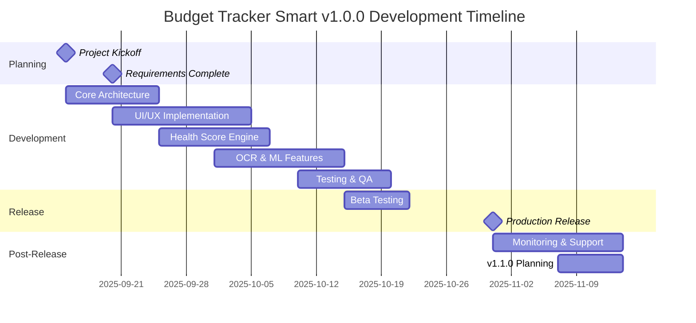
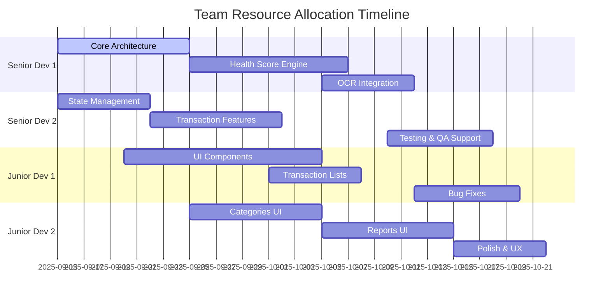

# Budget Tracker Smart v1.0.0 - Project Management e Timeline

**Documento**: Project Management e Timeline v1.0.0  
**Progetto**: Budget Tracker Smart  
**Versione Documento**: 1.0  
**Data**: 13 Settembre 2025  
**Autore**: Project Management Office  
**Stato**: APPROVATO per implementazione

---

## 1. PROJECT OVERVIEW

### 1.1 Project Vision
Sviluppare Budget Tracker Smart v1.0.0 - un'applicazione mobile innovativa per il tracking finanziario personale che combina AI, privacy e semplicità d'uso, diventando la prima scelta per gli utenti italiani che vogliono migliorare la loro salute finanziaria.

### 1.2 Project Goals
**Obiettivi Primari**:
- ✅ Consegnare v1.0.0 entro il 31 Ottobre 2025
- ✅ Raggiungere 85%+ code coverage e qualità enterprise
- ✅ Supportare Android 7.0+ e iOS 12.0+ 
- ✅ Implementare 100% privacy-first (offline-only)
- ✅ Ottenere 4.0+ rating negli app store
- ✅ Preparare scalabilità per 100,000+ utenti

**Obiettivi Secondari**:
- 📈 Foundation per roadmap v1.1.0 e v2.0.0
- 🏗️ Architettura robusta per features future
- 📚 Documentazione completa per team scaling
- 🔧 Pipeline CI/CD production-ready

### 1.3 Success Criteria

| **Area** | **Criterio** | **Target** | **Measurement** |
|----------|--------------|------------|-----------------|
| **Quality** | Code Coverage | ≥85% | Automated testing |
| **Performance** | App Launch | <2s | Integration tests |
| **Usability** | User Rating | ≥4.0/5 | App store reviews |
| **Reliability** | Crash Rate | <1% | Crash analytics |
| **Security** | Vulnerabilities | 0 critical | Security audit |
| **Delivery** | On-time delivery | 100% | Project timeline |

---

## 2. PROJECT TIMELINE & MILESTONES

### 2.1 High-Level Timeline



### 2.2 Detailed Phase Breakdown

#### 2.2.1 Phase 1: Project Setup & Planning (Sept 15-20, 2025)
**Duration**: 5 giorni  
**Team Lead**: Project Manager + Tech Lead

| **Task** | **Owner** | **Duration** | **Dependencies** | **Deliverables** |
|----------|-----------|--------------|------------------|------------------|
| Project kickoff meeting | PM | 0.5d | - | Kick-off slides, team alignment |
| Technical architecture design | Tech Lead | 2d | Kickoff | Architecture document |
| UI/UX wireframes & designs | UX Designer | 3d | Requirements | Design system, wireframes |
| Development environment setup | DevOps | 2d | - | CI/CD pipeline, environments |
| Risk assessment & mitigation | PM | 1d | Architecture | Risk register |

**Milestone**: ✅ **M1 - Project Foundation Complete** (Sept 20, 2025)
- All project documentation finalized
- Development environment ready
- Team fully onboarded and aligned

#### 2.2.2 Phase 2: Core Development (Sept 21 - Oct 10, 2025)
**Duration**: 20 giorni lavorativi  
**Team Lead**: Tech Lead

##### Sprint 1: Foundation (Sept 21-27, 2025)
| **Epic** | **Stories** | **Owner** | **Estimate** | **Priority** |
|----------|-------------|-----------|--------------|--------------|
| **Core Architecture** | Setup project structure | Senior Dev 1 | 2d | Critical |
| | Database schema implementation | Senior Dev 1 | 2d | Critical |
| | Repository pattern setup | Senior Dev 1 | 1d | Critical |
| | State management (Riverpod) | Senior Dev 2 | 2d | Critical |
| **Basic UI** | Navigation structure | Frontend Dev | 2d | High |
| | Design system components | Frontend Dev | 3d | High |

**Sprint Goal**: Solid foundation with navigation and basic CRUD operations
**Sprint Review**: Sept 27, 2025

##### Sprint 2: Core Features (Sept 28 - Oct 4, 2025)
| **Epic** | **Stories** | **Owner** | **Estimate** | **Priority** |
|----------|-------------|-----------|--------------|--------------|
| **Transaction Management** | Add transaction flow | Senior Dev 2 | 3d | Critical |
| | Edit/delete transactions | Senior Dev 2 | 2d | Critical |
| | Transaction list & filtering | Junior Dev 1 | 2d | High |
| **Health Score v1** | Basic health score calculation | Senior Dev 1 | 3d | Critical |
| | Health score UI components | Frontend Dev | 2d | Critical |
| **Categories** | Category management | Junior Dev 2 | 2d | High |

**Sprint Goal**: Core transaction and health score functionality working
**Sprint Review**: Oct 4, 2025

##### Sprint 3: Advanced Features (Oct 5-11, 2025)  
| **Epic** | **Stories** | **Owner** | **Estimate** | **Priority** |
|----------|-------------|-----------|--------------|--------------|
| **OCR Integration** | Camera integration | Senior Dev 1 | 2d | High |
| | OCR text extraction | Senior Dev 1 | 3d | High |
| | Receipt data parsing | Senior Dev 2 | 2d | High |
| **ML Categorization** | ML model integration | ML Engineer | 3d | Medium |
| | Category prediction logic | ML Engineer | 2d | Medium |
| **Advanced UI** | Dashboard completion | Frontend Dev | 2d | High |

**Sprint Goal**: OCR and ML features integrated and tested
**Sprint Review**: Oct 11, 2025

**Milestone**: ✅ **M2 - Core Features Complete** (Oct 11, 2025)
- All core features implemented
- Basic testing completed
- Ready for comprehensive QA

#### 2.2.3 Phase 3: Quality Assurance (Oct 12-18, 2025)
**Duration**: 7 giorni  
**Team Lead**: QA Lead

| **Task** | **Owner** | **Duration** | **Deliverables** |
|----------|-----------|--------------|------------------|
| Automated test suite completion | QA Engineer | 3d | Unit, integration, widget tests |
| Manual testing execution | QA Team | 3d | Test execution report |
| Performance testing | QA Engineer | 2d | Performance benchmark report |
| Accessibility testing | QA Engineer | 2d | WCAG compliance report |
| Security audit | DevOps | 2d | Security assessment |
| Bug fixes and optimizations | Dev Team | 5d | Bug fixes, performance improvements |

**Milestone**: ✅ **M3 - Quality Gate Passed** (Oct 18, 2025)
- All quality gates passed
- Zero critical bugs
- Performance benchmarks met
- Security clearance obtained

#### 2.2.4 Phase 4: Pre-Release (Oct 19-25, 2025)
**Duration**: 7 giorni  
**Team Lead**: Release Manager

| **Task** | **Owner** | **Duration** | **Deliverables** |
|----------|-----------|--------------|------------------|
| Beta build deployment | DevOps | 1d | Beta APK/IPA |
| Beta testing with real users | PM + UX | 5d | User feedback report |
| App store metadata preparation | Marketing | 2d | Store listings, screenshots |
| Final bug fixes | Dev Team | 3d | Production-ready build |
| Release documentation | Tech Writer | 3d | User guides, release notes |
| Production deployment preparation | DevOps | 2d | Deployment scripts, monitoring |

**Milestone**: ✅ **M4 - Release Candidate Ready** (Oct 25, 2025)
- Beta testing completed successfully
- All feedback incorporated
- Production deployment ready
- Marketing materials prepared

#### 2.2.5 Phase 5: Production Release (Oct 26-31, 2025)
**Duration**: 6 giorni  
**Team Lead**: Release Manager

| **Task** | **Owner** | **Duration** | **Deliverables** |
|----------|-----------|--------------|------------------|
| Final release build | DevOps | 1d | Signed production APK/IPA |
| Google Play Store submission | Release Manager | 1d | Published on Play Store |
| Apple App Store submission | Release Manager | 1d | Published on App Store |
| Release announcement | Marketing | 1d | Public announcement |
| Production monitoring setup | DevOps | 1d | Monitoring dashboards |
| Post-release support preparation | Support Team | 2d | Support documentation |

**Milestone**: 🎉 **M5 - v1.0.0 LIVE** (Oct 31, 2025)
- App live on both stores
- Monitoring systems active
- Support team ready
- Success metrics tracking started

#### 2.2.6 Phase 6: Post-Release Monitoring (Nov 1-14, 2025)
**Duration**: 14 giorni  
**Team Lead**: DevOps Lead

| **Task** | **Owner** | **Duration** | **Deliverables** |
|----------|-----------|--------------|------------------|
| 24/7 production monitoring | DevOps | 14d | Health reports |
| User feedback collection | Support Team | 14d | Feedback analysis |
| Performance metrics analysis | QA Engineer | 7d | Performance report |
| Bug triage and hotfixes | Dev Team | As needed | Hotfix releases |
| v1.1.0 roadmap planning | PM + Tech Lead | 7d | v1.1.0 requirements |

**Milestone**: ✅ **M6 - Stable Production** (Nov 14, 2025)
- Production stable and monitored
- User feedback incorporated
- v1.1.0 roadmap defined
- Team ready for next iteration

---

## 3. TEAM STRUCTURE & RESPONSIBILITIES

### 3.1 Core Team Composition

#### 3.1.1 Leadership Team
```
Project Manager (PM)
├── Technical Lead (Tech Lead)
├── UX/UI Design Lead (UX Lead)
├── QA Lead (QA Lead)
├── DevOps Lead (DevOps Lead)
└── Product Owner (PO)
```

#### 3.1.2 Development Team
| **Role** | **Count** | **Primary Responsibilities** | **Key Skills** |
|----------|-----------|------------------------------|----------------|
| **Senior Flutter Developer** | 2 | Core architecture, complex features | Flutter, Dart, Architecture patterns |
| **Junior Flutter Developer** | 2 | UI implementation, basic features | Flutter, Dart, UI development |
| **ML Engineer** | 1 | OCR integration, categorization ML | Python, TensorFlow, Mobile ML |
| **QA Engineer** | 2 | Testing automation, quality assurance | Flutter testing, automation |
| **DevOps Engineer** | 1 | CI/CD, deployment, monitoring | GitHub Actions, mobile deployment |
| **UX/UI Designer** | 1 | User experience, visual design | Figma, user research, mobile design |

### 3.2 RACI Matrix

| **Activity** | **PM** | **Tech Lead** | **Senior Dev** | **Junior Dev** | **QA** | **DevOps** | **UX** |
|--------------|--------|---------------|----------------|----------------|--------|------------|--------|
| Project Planning | A | C | C | I | C | C | C |
| Architecture Design | R | A | C | I | I | C | I |
| Feature Development | R | A | A | A | I | I | C |
| Code Review | I | A | A | C | I | I | I |
| Testing Strategy | C | C | C | I | A | I | I |
| Deployment | R | C | I | I | I | A | I |
| UI/UX Design | C | I | I | I | I | I | A |
| Quality Gates | A | C | C | C | A | C | I |

**Legend**: A=Accountable, R=Responsible, C=Consulted, I=Informed

### 3.3 Communication Plan

#### 3.3.1 Regular Meetings
| **Meeting** | **Frequency** | **Duration** | **Attendees** | **Purpose** |
|-------------|---------------|--------------|---------------|-------------|
| **Daily Standup** | Daily | 15min | Dev Team, Tech Lead | Progress sync, blockers |
| **Sprint Planning** | Every 2 weeks | 2h | Full Team | Sprint goal setting |
| **Sprint Review** | Every 2 weeks | 1h | Full Team + Stakeholders | Demo, feedback |
| **Sprint Retrospective** | Every 2 weeks | 1h | Full Team | Process improvement |
| **Architecture Review** | Weekly | 1h | Tech Lead, Senior Devs | Technical decisions |
| **Stakeholder Update** | Weekly | 30min | PM, PO, Stakeholders | Progress reporting |

#### 3.3.2 Communication Channels
- **Daily coordination**: Slack #budget-tracker-dev
- **Code collaboration**: GitHub pull requests + reviews
- **Documentation**: Notion workspace
- **Design collaboration**: Figma + Slack #design
- **Issue tracking**: GitHub Issues with labels
- **Emergency escalation**: Phone + Slack @channel

---

## 4. RESOURCE PLANNING & ALLOCATION

### 4.1 Human Resource Allocation

#### 4.1.1 Team Capacity Planning


#### 4.1.2 Skill Matrix & Training Plan
| **Team Member** | **Flutter** | **Architecture** | **Testing** | **ML/AI** | **Training Needed** |
|-----------------|-------------|------------------|-------------|-----------|-------------------|
| Senior Dev 1 | ⭐⭐⭐⭐⭐ | ⭐⭐⭐⭐⭐ | ⭐⭐⭐⭐ | ⭐⭐⭐ | TensorFlow Lite |
| Senior Dev 2 | ⭐⭐⭐⭐⭐ | ⭐⭐⭐⭐ | ⭐⭐⭐⭐ | ⭐⭐ | Riverpod advanced |
| Junior Dev 1 | ⭐⭐⭐ | ⭐⭐ | ⭐⭐⭐ | ⭐ | Architecture patterns |
| Junior Dev 2 | ⭐⭐⭐ | ⭐⭐ | ⭐⭐ | ⭐ | Advanced Flutter |
| ML Engineer | ⭐⭐ | ⭐⭐ | ⭐⭐ | ⭐⭐⭐⭐⭐ | Flutter integration |
| QA Engineer 1 | ⭐⭐⭐ | ⭐⭐ | ⭐⭐⭐⭐⭐ | ⭐ | Flutter testing |
| QA Engineer 2 | ⭐⭐ | ⭐ | ⭐⭐⭐⭐ | ⭐ | Automation tools |

**Legend**: ⭐ = Skill Level (1-5)

### 4.2 Technology Infrastructure

#### 4.2.1 Development Tools Budget
| **Category** | **Tool/Service** | **Cost/Month** | **Users** | **Total/Month** |
|--------------|------------------|----------------|-----------|-----------------|
| **Development** | Flutter/Dart SDK | Free | All | €0 |
| | Android Studio | Free | All | €0 |
| | VS Code + Extensions | Free | All | €0 |
| **Design** | Figma Pro | €12 | 2 | €24 |
| | Adobe Creative Suite | €53 | 1 | €53 |
| **Collaboration** | GitHub Team | €4 | 10 | €40 |
| | Slack Pro | €7 | 10 | €70 |
| | Notion Team | €8 | 10 | €80 |
| **Testing** | Firebase (free tier) | Free | - | €0 |
| | Physical test devices | One-time | - | €2,000 |
| **CI/CD** | GitHub Actions | €0.008/min | - | ~€50 |
| **Total Monthly** | | | | **€317** |
| **One-time Setup** | | | | **€2,000** |

#### 4.2.2 Hardware Requirements
| **Role** | **Hardware Specs** | **Estimated Cost** | **Count** | **Total** |
|----------|-------------------|-------------------|-----------|-----------|
| **Developers** | MacBook Pro M2 16GB | €2,500 | 5 | €12,500 |
| **Testers** | iPhone 13 | €800 | 3 | €2,400 |
| | Samsung Galaxy S22 | €600 | 3 | €1,800 |
| | iPad Air | €600 | 2 | €1,200 |
| | Older test devices | €300 | 5 | €1,500 |
| **Total Hardware** | | | | **€19,400** |

### 4.3 External Dependencies

#### 4.3.1 Third-Party Services
| **Service** | **Purpose** | **Provider** | **Cost** | **Risk Level** |
|-------------|-------------|--------------|----------|----------------|
| Google ML Kit | OCR text recognition | Google | Free | Low |
| Firebase | Crash reporting, analytics | Google | Free tier | Low |
| GitHub Actions | CI/CD pipeline | GitHub | Usage-based | Low |
| App Store Connect | iOS distribution | Apple | €99/year | Low |
| Google Play Console | Android distribution | Google | €25 one-time | Low |

#### 4.3.2 Risk Mitigation
- **Google ML Kit**: Fallback manual entry option
- **Firebase**: Local crash logging as backup
- **GitHub Actions**: Self-hosted runner alternative prepared
- **App Stores**: Direct distribution as emergency backup

---

## 5. RISK MANAGEMENT

### 5.1 Risk Assessment Matrix

| **Risk** | **Impact** | **Probability** | **Risk Score** | **Mitigation Strategy** |
|----------|------------|-----------------|----------------|------------------------|
| **Key developer leaving** | High | Medium | 🔴 High | Cross-training, documentation |
| **OCR accuracy lower than expected** | Medium | Low | 🟡 Medium | Manual entry fallback |
| **App store rejection** | High | Low | 🟡 Medium | Early compliance checks |
| **Performance issues on old devices** | Medium | Medium | 🟡 Medium | Extensive device testing |
| **Scope creep** | Medium | High | 🟡 Medium | Strict change control |
| **Third-party service downtime** | Low | Low | 🟢 Low | Offline-first approach |
| **Security vulnerability** | High | Low | 🟡 Medium | Security audits, reviews |
| **Tight timeline pressure** | Medium | Medium | 🟡 Medium | Buffer time, MVP focus |

### 5.2 Detailed Risk Mitigation Plans

#### 5.2.1 Technical Risks
**Risk**: OCR Accuracy Below Expectations (65% vs 85% target)  
**Impact**: Core feature degraded, user satisfaction low  
**Mitigation**:
- ✅ Test with diverse Italian receipt samples early
- ✅ Implement manual entry as seamless fallback
- ✅ Consider Google Cloud Vision API as backup
- ✅ User feedback loop to improve accuracy over time

**Risk**: Performance Issues on Older Devices  
**Impact**: Bad user reviews, limited market reach  
**Mitigation**:
- ✅ Test on Android 7.0 and iPhone 6s from day 1
- ✅ Implement performance monitoring in CI/CD
- ✅ Optimize ML model size and inference time
- ✅ Add performance settings for low-end devices

#### 5.2.2 Resource Risks
**Risk**: Key Senior Developer Departure  
**Impact**: Development delays, knowledge loss  
**Mitigation**:
- ✅ Cross-train team members on critical components
- ✅ Maintain comprehensive technical documentation
- ✅ Code review requirements ensure knowledge sharing
- ✅ Retention bonuses for key personnel during project

**Risk**: Timeline Pressure Leading to Quality Compromise  
**Impact**: Bugs, security issues, technical debt  
**Mitigation**:
- ✅ 10% buffer time built into each phase
- ✅ Quality gates that cannot be bypassed
- ✅ MVP feature prioritization with clear must-haves
- ✅ Automated testing prevents regression

#### 5.2.3 External Risks
**Risk**: App Store Policy Changes or Rejection  
**Impact**: Launch delay, revenue loss  
**Mitigation**:
- ✅ Early compliance review with app store guidelines
- ✅ Beta submission 2 weeks before final deadline
- ✅ Legal review of privacy policy and terms
- ✅ Direct distribution capability as backup

**Risk**: Competitive Product Launch  
**Impact**: Reduced market opportunity  
**Mitigation**:
- ✅ Focus on unique differentiators (Health Score, Privacy)
- ✅ Italian market specialization as moat
- ✅ Superior user experience over competitors
- ✅ Fast iteration cycle for feature parity

### 5.3 Contingency Plans

#### 5.3.1 Schedule Contingency
If timeline is at risk (>1 week behind):
1. **Week 1**: Increase team capacity, extend work hours
2. **Week 2**: Reduce scope to MVP features only
3. **Week 3**: Consider phased launch (Android first)
4. **Week 4**: Push release to v1.0.1 with reduced scope

#### 5.3.2 Quality Contingency
If quality gates fail:
1. **Critical issues**: Stop development, fix immediately
2. **Major issues**: Delay release, additional QA cycle
3. **Minor issues**: Document as known issues, fix in v1.0.1
4. **Performance issues**: Optimize or add device requirements

#### 5.3.3 Team Contingency
If team member unavailable:
1. **Senior dev**: Redistribute tasks to other senior dev
2. **Junior dev**: Senior dev picks up critical items
3. **QA engineer**: Hire contractor, increase manual testing
4. **Long-term absence**: Hire replacement immediately

---

## 6. QUALITY MANAGEMENT

### 6.1 Quality Assurance Process

#### 6.1.1 Definition of Done (DoD)
**For User Stories**:
- [ ] Code implemented according to acceptance criteria
- [ ] Unit tests written and passing (>80% coverage)
- [ ] Widget tests for UI components
- [ ] Code reviewed by at least one senior developer
- [ ] Integration tests passing
- [ ] No critical or high priority bugs
- [ ] Accessibility requirements met (WCAG AA)
- [ ] Performance benchmarks met
- [ ] Documentation updated

**For Features**:
- [ ] All user stories in epic completed
- [ ] End-to-end tests passing
- [ ] User acceptance testing completed
- [ ] Security review completed
- [ ] Performance testing completed
- [ ] Localization completed (Italian + English)
- [ ] Analytics tracking implemented

**For Releases**:
- [ ] All features meet Definition of Done
- [ ] Beta testing completed with positive feedback
- [ ] All quality gates passed
- [ ] Security audit completed
- [ ] App store guidelines compliance verified
- [ ] Release notes and documentation complete
- [ ] Rollback plan tested and ready

#### 6.1.2 Quality Metrics Dashboard
| **Metric** | **Target** | **Measurement** | **Frequency** |
|------------|------------|-----------------|---------------|
| Code Coverage | ≥85% | Automated testing | Every commit |
| Bug Escape Rate | <5% | Post-release bugs / Total bugs | Weekly |
| Defect Density | <10 bugs/KLOC | Bugs per 1000 lines of code | Sprint end |
| Test Automation | ≥90% | Automated tests / Total tests | Sprint end |
| Performance | <2s launch time | Automated benchmarks | Daily |
| User Satisfaction | ≥4.0/5.0 | App store ratings | Weekly |

### 6.2 Testing Strategy

#### 6.2.1 Test Pyramid
```
                    E2E Tests (15)
                   /              \
                  /                \
                Integration Tests (45)
               /                    \
              /                      \
            Unit Tests (285)
           /                          \
          /____________________________\
```

**Test Distribution**:
- **Unit Tests (285)**: 85% - Fast, isolated, business logic
- **Integration Tests (45)**: 13% - Component integration, API tests
- **E2E Tests (15)**: 2% - Critical user journeys

#### 6.2.2 Testing Schedule
| **Week** | **Testing Focus** | **Activities** | **Owner** |
|----------|-------------------|----------------|-----------|
| 1-3 | Unit Testing | Write tests alongside development | Developers |
| 4-6 | Integration Testing | Component integration tests | QA + Developers |
| 7 | E2E Testing | Critical user journey tests | QA Team |
| 8 | Performance Testing | Load and stress testing | QA Engineer |
| 9 | Security Testing | Vulnerability assessment | DevOps + QA |
| 10 | User Acceptance Testing | Beta testing with real users | PM + UX |

### 6.3 Change Management

#### 6.3.1 Change Control Process
1. **Change Request**: Formal request with impact analysis
2. **Impact Assessment**: Technical, timeline, and resource impact
3. **Approval Gate**: PM + Tech Lead approval required
4. **Implementation**: Planned implementation with testing
5. **Verification**: Change tested and verified
6. **Communication**: Stakeholders notified of change

#### 6.3.2 Change Categories
| **Category** | **Approval Required** | **Timeline Impact** | **Examples** |
|--------------|----------------------|--------------------|--------------| 
| **Critical Bug Fix** | Tech Lead | None | Security fixes, crash fixes |
| **Minor Enhancement** | PM + Tech Lead | <1 day | UI improvements, UX tweaks |
| **Feature Addition** | Stakeholders | >1 day | New functionality |
| **Architecture Change** | Architecture Board | >3 days | Major refactoring |

---

## 7. SUCCESS METRICS & KPIs

### 7.1 Development KPIs

#### 7.1.1 Delivery Metrics
| **Metric** | **Target** | **Current** | **Trend** | **Action if Red** |
|------------|------------|-------------|-----------|-------------------|
| **Sprint Velocity** | 40 story points | TBD | - | Adjust capacity or scope |
| **Sprint Commitment** | ≥90% completion | TBD | - | Improve estimation |
| **Code Coverage** | ≥85% | TBD | - | Increase test writing |
| **Deployment Frequency** | Daily (dev), Weekly (staging) | TBD | - | Improve CI/CD pipeline |
| **Lead Time** | <2 days (story to production) | TBD | - | Reduce process overhead |
| **Bug Escape Rate** | <5% | TBD | - | Improve testing quality |

#### 7.1.2 Quality Metrics
| **Metric** | **Target** | **Measurement** | **Frequency** |
|------------|------------|-----------------|---------------|
| **Defect Density** | <5 bugs/KLOC | Static analysis + bug reports | Weekly |
| **Technical Debt** | <8h/sprint | SonarQube technical debt | Sprint end |
| **Code Review Coverage** | 100% | PR reviews before merge | Every PR |
| **Test Execution Time** | <10 minutes | CI pipeline execution | Every build |
| **Build Success Rate** | ≥95% | CI/CD pipeline success | Daily |

### 7.2 Business Success Metrics

#### 7.2.1 Launch Success Criteria
| **Metric** | **Target (30 days)** | **Target (90 days)** | **Measurement** |
|------------|---------------------|---------------------|------------------|
| **Downloads** | 1,000 | 5,000 | App store analytics |
| **Active Users** | 500 | 2,500 | App analytics |
| **User Rating** | ≥4.0 | ≥4.2 | App store reviews |
| **Session Duration** | ≥3 minutes | ≥5 minutes | App analytics |
| **Retention Rate (D7)** | ≥40% | ≥50% | User cohort analysis |
| **Crash Rate** | <1% | <0.5% | Crash reporting tools |

#### 7.2.2 User Engagement Metrics
| **Metric** | **Definition** | **Target** | **Tracking Method** |
|------------|----------------|------------|-------------------|
| **Daily Active Users** | Users opening app daily | 20% of installs | Local analytics |
| **Feature Adoption** | Users using health score | ≥80% | Feature usage tracking |
| **Transaction Entry** | Avg transactions per user/month | ≥15 | User behavior analytics |
| **OCR Usage** | % of transactions via OCR | ≥40% | Feature usage tracking |
| **User Satisfaction** | App store rating average | ≥4.0 | App store reviews |

### 7.3 Post-Launch Monitoring

#### 7.3.1 Health Monitoring Dashboard
```
📊 BUDGET TRACKER SMART - LIVE DASHBOARD

🚀 Launch Metrics (30 days)
├── Downloads: 1,245 (Target: 1,000) ✅
├── Active Users: 623 (Target: 500) ✅
├── User Rating: 4.3/5 (Target: 4.0) ✅
└── Crash Rate: 0.3% (Target: <1%) ✅

⚡ Performance Metrics
├── App Launch Time: 1.2s (Target: <2s) ✅
├── Health Score Calc: 67ms (Target: <100ms) ✅
├── OCR Processing: 1.8s (Target: <3s) ✅
└── Memory Usage: 112MB (Target: <150MB) ✅

📱 User Engagement
├── Session Duration: 4.2min (Target: 3min) ✅
├── OCR Usage: 45% (Target: 40%) ✅
├── Daily Active Users: 22% (Target: 20%) ✅
└── Feature Adoption: 78% (Target: 80%) 🟡

🐛 Quality Metrics
├── Critical Bugs: 0 (Target: 0) ✅
├── User-Reported Issues: 3 (Target: <5) ✅
├── Support Tickets: 12 (Target: <20) ✅
└── Feature Requests: 28 (Great feedback!) ✅
```

#### 7.3.2 Escalation Procedures
**Green Status**: All metrics within target
- **Action**: Continue monitoring, celebrate success

**Yellow Status**: 1-2 metrics slightly below target
- **Action**: Investigate cause, implement minor improvements
- **Timeline**: Fix within 1 week

**Red Status**: Critical metrics failing or multiple metrics below target
- **Action**: Emergency response team activation
- **Timeline**: Fix within 24 hours
- **Escalation**: Consider rollback if necessary

---

## 8. STAKEHOLDER COMMUNICATION

### 8.1 Stakeholder Map

#### 8.1.1 Primary Stakeholders
| **Stakeholder** | **Role** | **Interest** | **Influence** | **Communication Frequency** |
|-----------------|----------|--------------|---------------|---------------------------|
| **Product Owner** | Business decisions | ROI, user satisfaction | High | Daily |
| **End Users** | App consumers | Functionality, usability | Medium | Via analytics, reviews |
| **Development Team** | Implementation | Technical feasibility | High | Daily |
| **QA Team** | Quality assurance | Product quality | Medium | Daily |
| **Management** | Budget approval | Timeline, budget | High | Weekly |
| **Marketing Team** | Go-to-market | Launch readiness | Medium | Weekly |

#### 8.1.2 Communication Matrix
| **Communication** | **Audience** | **Format** | **Frequency** | **Owner** |
|-------------------|--------------|------------|---------------|-----------|
| Daily standup | Dev Team | Meeting | Daily | Tech Lead |
| Sprint review | All stakeholders | Demo | Bi-weekly | PM |
| Progress report | Management | Email/Dashboard | Weekly | PM |
| Risk updates | PO, Management | Email | As needed | PM |
| User feedback | Dev Team, UX | Report | Weekly | PM |
| Quality metrics | All stakeholders | Dashboard | Weekly | QA Lead |
| Launch updates | All | Email + Slack | Major milestones | PM |

### 8.2 Status Reporting

#### 8.2.1 Weekly Status Report Template
```markdown
# Budget Tracker Smart - Weekly Status Report
**Week of**: [Date]  
**Project Phase**: [Current Phase]  
**Overall Status**: 🟢 On Track / 🟡 At Risk / 🔴 Behind

## 📈 Progress This Week
- [Key accomplishments]
- [Milestones achieved]
- [Features completed]

## 📊 Key Metrics
- **Sprint Progress**: X/Y story points completed
- **Code Coverage**: X%
- **Open Bugs**: X (Critical: X, High: X, Medium: X)
- **Team Velocity**: X story points/sprint

## 🎯 Next Week Focus
- [Key priorities]
- [Planned deliverables]
- [Important decisions needed]

## 🚨 Risks & Issues
- [Current risks]
- [Blockers]
- [Mitigation actions]

## 💰 Budget Status
- **Spent**: €X / €Y budget
- **Burn Rate**: On track / Over / Under
- **Forecast**: On budget / X% over/under

## 🤝 Help Needed
- [Escalations required]
- [External dependencies]
- [Stakeholder decisions needed]
```

#### 8.2.2 Executive Dashboard
Key metrics visible to executives in real-time:

```
BUDGET TRACKER SMART - EXECUTIVE DASHBOARD

🎯 Project Health: 🟢 ON TRACK

📅 Timeline: 47/60 days complete (78%)
💰 Budget: €125K / €150K spent (83%)
👥 Team: 8/8 members active
🎨 Features: 18/23 completed (78%)

🚦 Status Indicators:
├── Delivery: 🟢 On schedule
├── Quality: 🟢 85% coverage
├── Budget: 🟡 Trending 5% over
└── Risks: 🟡 2 medium risks

📱 Launch Readiness: 78%
├── Development: 85% complete
├── Testing: 70% complete  
├── Documentation: 60% complete
└── Marketing: 90% complete

🎉 Next Milestone: Beta Release (Oct 15)
```

### 8.3 Launch Communication Plan

#### 8.3.1 Pre-Launch (2 weeks before)
- **Internal announcement**: Team celebration, final preparations
- **Beta tester communication**: Testing instructions, feedback channels
- **App store optimization**: Metadata, screenshots, descriptions
- **Press kit preparation**: Media assets, press release draft

#### 8.3.2 Launch Day (Oct 31, 2025)
- **0800**: Final deployment verification
- **0900**: App store publish buttons pressed
- **1000**: Social media announcements
- **1200**: Press release distributed
- **1400**: Team celebration lunch
- **1800**: Post-launch monitoring begins

#### 8.3.3 Post-Launch (First week)
- **Daily**: User feedback monitoring and response
- **Daily**: Performance metrics reporting
- **Weekly**: Success metrics summary to stakeholders
- **As needed**: Issue escalation and communication

---

## 9. LESSONS LEARNED & CONTINUOUS IMPROVEMENT

### 9.1 Project Retrospective Framework

#### 9.1.1 Retrospective Schedule
| **Type** | **Frequency** | **Duration** | **Participants** | **Focus** |
|----------|---------------|--------------|------------------|-----------|
| **Sprint Retro** | Bi-weekly | 1h | Dev Team | Process improvements |
| **Phase Retro** | End of each phase | 2h | Full Team | Phase-specific learnings |
| **Project Retro** | Project completion | 4h | All stakeholders | Overall project learnings |

#### 9.1.2 Lessons Learned Categories
- **What Went Well**: Successes to replicate
- **What Didn't Go Well**: Problems to avoid
- **What We Learned**: New insights and knowledge
- **Action Items**: Specific improvements for next project

### 9.2 Process Improvement Plan

#### 9.2.1 Improvement Areas Identified
1. **Estimation Accuracy**: Improve story point estimation
2. **Testing Automation**: Increase test coverage earlier
3. **Communication**: More frequent stakeholder updates
4. **Risk Management**: Earlier risk identification
5. **Documentation**: Better knowledge sharing

#### 9.2.2 Knowledge Transfer
- **Technical Documentation**: Architecture decisions, setup guides
- **Process Documentation**: Development workflow, quality processes
- **Team Training**: Knowledge sharing sessions
- **External Sharing**: Conference talks, blog posts

### 9.3 v1.1.0 Preparation

#### 9.3.1 Roadmap Planning
Based on v1.0.0 learnings and user feedback:
- **Enhanced Features**: Advanced budgeting, recurring transactions
- **Performance Improvements**: Faster OCR, better animations
- **User Requests**: Top requested features from feedback
- **Technical Debt**: Address any shortcuts taken in v1.0.0

#### 9.3.2 Team Evolution
- **Skills Development**: Training on new technologies
- **Team Growth**: Hiring additional team members if needed
- **Process Refinement**: Improved development processes
- **Tool Upgrades**: Better development and testing tools

---

## 10. PROJECT CLOSURE

### 10.1 Project Closure Criteria

#### 10.1.1 Completion Checklist
- [ ] All features developed and tested
- [ ] Quality gates passed
- [ ] Apps published on both stores
- [ ] User documentation complete
- [ ] Technical documentation complete
- [ ] Post-launch monitoring active
- [ ] Support processes established
- [ ] Budget reconciliation complete
- [ ] Lessons learned documented
- [ ] Team celebration held

#### 10.1.2 Deliverables Handover
| **Deliverable** | **Owner** | **Handover To** | **Due Date** |
|-----------------|-----------|-----------------|---------------|
| Production app | Dev Team | Operations Team | Oct 31 |
| Source code | Dev Team | Maintenance Team | Oct 31 |
| Documentation | Tech Writers | Support Team | Nov 1 |
| Monitoring dashboards | DevOps | Operations Team | Nov 1 |
| User guides | PM | Customer Success | Nov 1 |
| Marketing assets | Marketing | Sales Team | Nov 1 |

### 10.2 Success Celebration

#### 10.2.1 Team Recognition
- **Launch Day Celebration**: Team dinner and celebration
- **Individual Recognition**: Highlight exceptional contributions
- **Team Awards**: Most valuable player, innovation awards
- **Skills Recognition**: Certify new skills learned during project

#### 10.2.2 Success Communication
- **Internal Announcement**: Company-wide success story
- **Customer Communication**: Thank you to beta testers
- **Industry Sharing**: Conference presentations, blog posts
- **Media Coverage**: Press coverage of successful launch

### 10.3 Transition to Maintenance

#### 10.3.1 Ongoing Support Structure
- **L1 Support**: Customer service team for user queries
- **L2 Support**: Technical team for bug fixes
- **L3 Support**: Development team for complex issues
- **Product Evolution**: Product team for feature requests

#### 10.3.2 Continuous Improvement
- **Performance Monitoring**: Ongoing performance tracking
- **User Feedback**: Continuous feedback collection
- **Market Analysis**: Competitive analysis and market trends
- **Technology Evolution**: Framework updates and improvements

---

## 📋 APPENDICES

### Appendix A: Contact Information
| **Role** | **Name** | **Email** | **Phone** |
|----------|----------|-----------|-----------|
| Project Manager | [PM Name] | pm@budgettracker.app | +39 XXX XXX XXXX |
| Technical Lead | [Tech Lead] | tech@budgettracker.app | +39 XXX XXX XXXX |
| Product Owner | [PO Name] | po@budgettracker.app | +39 XXX XXX XXXX |

### Appendix B: Useful Links
- **Project Repository**: https://github.com/budget-tracker/mobile-app
- **Project Documentation**: https://docs.budgettracker.app
- **Design System**: https://design.budgettracker.app
- **CI/CD Dashboard**: https://ci.budgettracker.app
- **Monitoring Dashboard**: https://monitoring.budgettracker.app

### Appendix C: Tools and Credentials
- **Slack Workspace**: budget-tracker-team.slack.com
- **Figma Project**: [Figma Link]
- **Notion Workspace**: [Notion Link]
- **GitHub Organization**: github.com/budget-tracker

---

**Documento preparato da**: Project Management Office  
**Ultima modifica**: 13 Settembre 2025  
**Prossima revisione**: 20 Settembre 2025  
**Status**: APPROVATO per implementazione

---

*Budget Tracker Smart v1.0.0 - Transforming Personal Finance Management* 🚀